# ElectroWorld backend — business flows

**Purpose.** This document describes, process by process, what the ElectroWorld backend actually does: who can trigger each flow, what must be true first, the steps the code takes, the rules it enforces, and every outcome a client can observe. It is written from the code (the source of truth). Code is referenced as file path plus class/method, never by line number.

**Audience.** Product owner, backend and Flutter developers, QA, and whoever operates the AI provider.

**Companion documents.**

- [docs/FRONTEND_API.md](FRONTEND_API.md) — exact request/response shapes, headers and status codes per endpoint.
- [docs/AI_INTEGRATION_CONTRACT.md](AI_INTEGRATION_CONTRACT.md) — the AI contract (version `"2"`): hint, hints and essay-evaluation requests and responses.

When this document and the code disagree, the code wins.

## Table of contents

- [1. System at a glance](#1-system-at-a-glance)
  - [Modules and responsibilities](#modules-and-responsibilities)
  - [Roles](#roles)
  - [Learner journey](#learner-journey)
- [2. Glossary](#2-glossary)
- [3. Users module](#3-users-module)
  - [Guest access](#guest-access)
  - [Email registration (new account)](#email-registration-new-account)
  - [Guest → account upgrade (email or Google)](#guest--account-upgrade-email-or-google)
  - [Email login](#email-login)
  - [Google sign-in](#google-sign-in)
  - [Token issuance and session lifecycle (refresh rotation, logout)](#token-issuance-and-session-lifecycle-refresh-rotation-logout)
  - [Password reset (forgot password → verify OTP → reset)](#password-reset-forgot-password--verify-otp--reset)
  - [Age capture after sign-in](#age-capture-after-sign-in)
  - [Profile read and update](#profile-read-and-update)
  - [Roles, account status and parent–child links](#roles-account-status-and-parentchild-links)
- [4. Content module](#4-content-module)
  - [Browsing the learning catalogue (levels, lessons, lesson contents, content types)](#browsing-the-learning-catalogue-levels-lessons-lesson-contents-content-types)
  - [Level management (create, update, delete)](#level-management-create-update-delete)
  - [Lesson management (create, update / move, delete)](#lesson-management-create-update--move-delete)
  - [Lesson publication and quiz gating](#lesson-publication-and-quiz-gating)
  - [Lesson content management (create, update, delete)](#lesson-content-management-create-update-delete)
  - [Reordering by swap (levels, lessons, lesson contents)](#reordering-by-swap-levels-lessons-lesson-contents)
  - [Media (image) upload and file lifecycle](#media-image-upload-and-file-lifecycle)
- [5. Assessment module](#5-assessment-module)
  - [Quiz authoring (create, update, activate)](#quiz-authoring-create-update-activate)
  - [Assessment category and topic authoring](#assessment-category-and-topic-authoring)
  - [Question authoring and activation (types, points, mandatory image descriptions)](#question-authoring-and-activation-types-points-mandatory-image-descriptions)
  - [Option authoring (choices, correct answer, images)](#option-authoring-choices-correct-answer-images)
  - [Lesson quiz preview](#lesson-quiz-preview)
  - [First-run placement test](#first-run-placement-test)
  - [Quiz attempt start and resume (question snapshot)](#quiz-attempt-start-and-resume-question-snapshot)
  - [Quiz attempt submission (validation, grading with points, storage, statistics, concurrency)](#quiz-attempt-submission-validation-grading-with-points-storage-statistics-concurrency)
  - [Result recovery](#result-recovery)
  - [Abandoned-attempt expiry and sweeper](#abandoned-attempt-expiry-and-sweeper)
  - [Retry of wrong answers](#retry-of-wrong-answers)
  - [Hint button (escalating hints during an attempt)](#hint-button-escalating-hints-during-an-attempt)
  - [Post-submit hints for retry questions](#post-submit-hints-for-retry-questions)
  - [AI essay grading lifecycle](#ai-essay-grading-lifecycle)
  - [User topic statistics](#user-topic-statistics)
- [6. Cross-cutting rules](#6-cross-cutting-rules)
  - [Request pipeline and authentication](#request-pipeline-and-authentication)
  - [Response shapes](#response-shapes)
  - [Error model](#error-model)
  - [Ownership and privacy](#ownership-and-privacy)
  - [What a child never sees](#what-a-child-never-sees)
  - [Localization](#localization)
  - [Concurrency and idempotency](#concurrency-and-idempotency)
- [7. Configuration reference](#7-configuration-reference)
  - [Assessment:*](#assessment)
  - [Ai:*](#ai)

---

## 1. System at a glance

### Modules and responsibilities

ElectroWorld is an ASP.NET Core 8 modular monolith. One host process runs every module against SQL Server.

| Module | Projects | Responsibility |
|---|---|---|
| Host | `ElectroWorld` | Controllers, `ExceptionMiddleware`, JWT authentication, Swagger (`ElectroWorld/Swagger/*`), static files (`wwwroot/uploads`), hosted background services (`AbandonedQuizAttemptSweeper`, `EssayEvaluationWorker`) |
| Users | `UsersBL`, `UsersDA`, `Shared/Users` | Guest accounts, email/Google sign-in, refresh-token rotation, password reset by OTP, profile and age, roles |
| Content | `ContentBL`, `ContentDA` | Ordered levels, lessons (draft/published) and lesson content blocks; image upload |
| Assessment | `AssessmentBL`, `AssessmentDA` | Category, topic, quiz, question and option authoring; placement test; attempts with a frozen question snapshot; points scoring; retry; hints; AI essay grading; per-topic statistics and the child's progress map (XP, mastery, stars) |
| AI integration | `AIIntegration`, `Shared/Assessment/AI` | HTTP client for the external AI provider and the shared AI contract types |
| Shared | `Shared` | `ApiResponse` envelope, exceptions (`Shared/Common/Exceptions`), JWT generation, cross-module contracts |
| Tests | `Tests/Assessment.Tests` | Pin Assessment behaviour and exact JSON shapes |

Modules talk to each other only through contracts in `Shared`, with no cross-module foreign keys:

- `Shared/Content/ILevelCatalog` (implemented by `ContentBL.Services.LevelCatalogService`) — level order, used by quiz authoring and placement.
- `Shared/Content/ILessonAvailability` (implemented by `ContentBL.Services.LessonAvailabilityService`) — whether a lesson exists and is published.
- `Shared/Content/IMediaContentReader` (implemented by `ContentBL.Services.LocalMediaContentReader`) — reads an uploaded image's bytes for the AI, only when `Assessment:AiSendImageContent` is on.
- `Shared/Users/ILearnerProfile` (implemented by `UsersBL.Services.LearnerProfileService`) — the learner's age only, used in AI hint requests.

### Roles

| Role | How obtained | What it can do |
|---|---|---|
| **Child** | Default role at guest creation, registration and Google sign-up (`AuthService.NormalizeRole`) | Browse content, take placement (the only role allowed on `/api/placement`), start and submit attempts, retry, request hints, read own statistics and profile |
| **Parent** | Send `role: "parent"` (any case) at guest creation, registration or Google sign-up | Same as any authenticated user except the placement endpoints; there are no Parent-only features and parent–child links are not implemented |
| **Admin** | Not obtainable through the API; must be set directly in the database | Every endpoint open to any authenticated user (not the Child-only placement endpoints) plus all Content writes, image upload and Assessment authoring |
| **Guest** (not a role) | `POST /api/auth/guest`; `authProvider = "Guest"` with role Child or Parent | Same permissions as its role; can later be upgraded to an email or Google account on the same user id |

### Learner journey

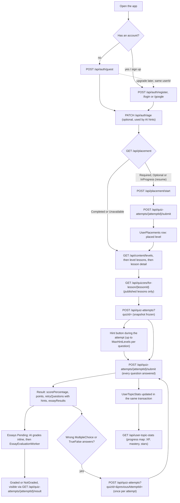

---

## 2. Glossary

| Term | Meaning in this system |
|---|---|
| **Attempt** | One run of a quiz by one user (`Assessment.QuizAttempts`). Status `InProgress`, `Completed` (submitted and graded, exactly once) or `Abandoned` (expired before submit, final). |
| **Snapshot** | The per-question values frozen in `QuizAttemptQuestions` when an attempt starts: `TopicId` (null when the question has no topic), `Difficulty`, `QuestionType`, `CorrectOptionId` (answer key; null for Essay) and `Points`. Grading, points, placement and statistics use the snapshot, never the live question. |
| **Auto-graded question** | A `MultipleChoice` or `TrueFalse` question, graded against the snapshot answer key at submit. |
| **Essay** | A free-text question. Never in `scorePercentage` or in topic statistics counts (a Graded essay does earn XP), graded only by the AI after submit. |
| **Mistake** | A stored wrong answer (`QuizAttemptMistakes`). Only wrong auto-graded answers are stored; a snapshot question with no mistake row was answered correctly. The submit body field `mistakes` nevertheless carries **all** auto-graded answers (historical name). |
| **Points** | A question's weight (`Questions.Points`, TINYINT > 0, default 1). Frozen per attempt. `scorePercentage` = points of correct auto-graded answers ÷ points of all auto-graded questions × 100 (2 decimals). `totalPoints` includes essays; `earnedPoints` = correct auto-graded points + awarded points of Graded essays; `pendingPoints` = max points of Pending essays. `correctAnswers`/`wrongAnswers` stay counts. |
| **Retry** | A new attempt started with `previousAttemptId`, containing only the previous attempt's wrong, still-active auto-graded questions. Each attempt can be retried at most once. |
| **Hint (post-submit)** | One AI hint per wrong answer generated right after submit (task `Hints`), shown in `retryQuestions` and carried into the retry. |
| **Hint level** | One accepted press of the Hint button (task `Hint`) on a question of a running attempt. Levels escalate (1 = soft nudge, 2 = more direct) up to `MaxHintLevels`. Each level is saved at most once per attempt and question, in any language. A press that yields no accepted hint uses no level and is not counted anywhere. |
| **hintsStatus** | `NotRequired` (no wrong answers), `Generated`, `Partial`, `Unavailable` — whether hints were produced. Never affects the score. |
| **Placement** | The first-run test (`Placement` quiz) that samples each level's `LevelAssessment` quiz and stores one `UserPlacements` row with the placed level. A level is **mastered** when earned ÷ total frozen points of its placement questions ≥ `PlacementPassPercentage`. |
| **Category / topic** | How questions are classified (`Assessment.Categories` → `Assessment.Topics`), managed by admins under `/api/assessment/categories` and `/api/assessment/topics`. A topic has a learning level (`Beginner`, `Intermediate`, `Advanced`). A question's topic is optional. |
| **XP** | Experience points on the child's progress map: the frozen `Points` of every correct MultipleChoice/TrueFalse answer plus the awarded points of every Graded essay, over all Completed attempts (retries and placement included). Read live, never stored; equal to the sum of `earnedPoints` of the child's results. |
| **Mastery** | A topic's state on the progress map, derived on every read from its counts: `NotStarted`, `Learning` (under 50% correct), `Practicing`, `Mastered` (at least `TopicMasteryPercentage`% correct over at least `TopicMasteryMinQuestions` answers). Shown as 0–3 stars. |
| **Essay status** | `Pending` → `Graded` (points and feedback) or `NotGraded` (final, no points). |
| **Essay outcome (`AiOutcome`)** | Internal only: `Accepted` (AI grade used), `Declined` (AI answered `Skipped`), `Failed` (no usable grade after the maximum attempts). Null while Pending. |
| **Claim** | A marker (`AiClaimId`) set atomically on essay rows by one evaluation run, so two runs never grade the same essay and a decision is saved only while the claim is held. |
| **Draft / published lesson** | `Lessons.IsPublished`. Only a published lesson's quiz can be looked up or started. |
| **Envelope** | `{ success, message, data }` (`Shared.Common.Api.ApiResponse<T>`). Used by all Users/Content responses and by every error response. |
| **Business rule error** | `BusinessRuleException` (`Shared/Common/Exceptions`): a well-formed request that breaks a rule. Becomes 400 with its message. |
| **Image description** | Admin-written text (`ImageDescription`, ≤ 1000 chars) required whenever a question or option has an image, because the AI does not read images. Never returned to a child. |

---

## 3. Users module

Identity and sessions: `UsersBL`, `UsersDA`, `Shared/Users`, exposed by `ElectroWorld/Controllers/Users/AuthController` and `UsersController`. Success and failure bodies use the `ApiResponse` envelope; each controller maps a service `Result` failure to a fixed status per endpoint (see section 6). Request/response shapes: [docs/FRONTEND_API.md](FRONTEND_API.md).

### Guest access

- **Purpose:** let a child (or parent) use the app right away without an email or Google account. The guest gets a real user row and real tokens, so progress is kept.
- **Actors:** anonymous app user.
- **Trigger / entry endpoint(s):** `POST /api/auth/guest` with body `{ fullName, role? }`.
- **Preconditions:** none. The endpoint is anonymous.
- **Flow:**
  1. `AuthController.RegisterGuest` calls `AuthService.RegisterGuestAsync`.
  2. It builds a new `User`:
     - `Id = Guid.NewGuid()`
     - `FullName` from the request
     - `Role = NormalizeRole(role)`
     - `AuthProvider = "Guest"`, `IsActive = true`, `CreatedAt = UtcNow`
     - no email, password hash, provider id or age
  3. It inserts into `Users.Users` and commits (`SaveChangesAsync`, commit 1).
  4. It issues tokens (see *Token issuance and session lifecycle*): inserts a row into `Users.RefreshTokens` and commits (commit 2).
  5. It returns `AuthResponse { userId, fullName, role, authProvider: "Guest", age: null, accessToken, refreshToken, accessTokenExpiresAt }`.
- **Business rules:**
  - Role is `"Parent"` only when the request sends `parent` in any letter case. Any other value, including `"Admin"` or none, becomes `"Child"` (`AuthService.NormalizeRole`).
  - No validation on `fullName` beyond model binding: an empty string is accepted (`AuthService.RegisterGuestAsync`).
  - Guests get exactly the same permissions as registered users of the same role. The `authProvider` claim is written into the JWT (`JwtTokenGenerator.GenerateAccessToken`), but no code reads it for authorization.
  - Guests have no password, so the refresh token is the only way back into a guest session (see *Email login*).
- **Outcomes & failures:**
  - 200 `"تم إنشاء حساب Guest بنجاح"` (guest account created) with `AuthResponse`. The service has no failure path.
  - Model-binding 400 when `fullName` is missing.
  - 500 if the database rejects the row (e.g. name longer than 150).

---

### Email registration (new account)

- **Purpose:** create a full account identified by email and password.
- **Actors:** anonymous app user: a child, or a parent.
- **Trigger / entry endpoint(s):** `POST /api/auth/register` with body `{ email, password, fullName, role?, age?, existingGuestUserId? }`. The guest-upgrade variant, when `existingGuestUserId` is sent, is its own process below.
- **Preconditions:** the email isn't already used by any user.
- **Flow (`AuthService.RegisterWithEmailAsync`, no `existingGuestUserId`):**
  1. Validate the email format (`IsValidEmail`).
  2. Validate the age: null, or 7–18 (`IsValidAge`).
  3. Check `UserRepository.EmailExistsAsync(email)` (exact match against `Users.Users.Email`).
  4. Build a new `User`:
     - `Email` from the request
     - `PasswordHash = BCrypt(password)` (`Shared.Common.Implementations.PasswordHasher`)
     - `FullName`, `Age` from the request
     - `Role = NormalizeRole(role)`
     - `AuthProvider = "Email"`, `IsActive = true`, `CreatedAt = UtcNow`
  5. Insert into `Users.Users` and commit (commit 1).
  6. Issue tokens: insert into `Users.RefreshTokens` and commit (commit 2).
- **Business rules:**
  - The email must parse as `System.Net.Mail.MailAddress`, and the parsed address must equal the input exactly. Display-name forms and surrounding spaces are rejected (`AuthService.IsValidEmail`).
  - Age, when given, must be 7–18 inclusive, **for Parents too** (`AuthService.IsValidAge`, constants `MinAge = 7`, `MaxAge = 18`).
  - Email must be unique (`AuthService.RegisterWithEmailAsync` via `UserRepository.EmailExistsAsync`). The EF model also declares the unique filtered index `UQ_Users_Email` (`UsersDbContext`).
  - Role follows `NormalizeRole`: Parent only if requested, otherwise Child. Admin can't be self-assigned.
  - No password strength or length rule exists anywhere.
  - The user row and the refresh token are two separate commits, with no wrapping transaction (`RegisterWithEmailAsync` then `IssueTokensAsync`). If the second fails, the account exists and the client gets a 500. The user can simply log in.
- **Outcomes & failures:**

  | Status | Message | Meaning |
  |---|---|---|
  | 200 | `"تم التسجيل بنجاح"` | registered successfully, with `AuthResponse` |
  | 400 | `"صيغة الإيميل غير صحيحة"` | invalid email format |
  | 400 | `"السن لازم يكون بين 7 و 18 سنة"` | age must be between 7 and 18 |
  | 400 | `"البريد الإلكتروني مستخدم بالفعل"` | email already in use |
  | 500 | generic | database constraint violated, e.g. a concurrent registration with the same email passing the check |

---

### Guest → account upgrade (email or Google)

- **Purpose:** turn an existing guest into a real account **on the same user row and the same `Id`**. All progress keyed by user id (quiz attempts, stats, placement) stays attached, with no data migration.
- **Actors:** anonymous caller (intended: the guest themself); Google, for the Google variant.
- **Trigger / entry endpoint(s):**
  - `POST /api/auth/register` with `existingGuestUserId`
  - `POST /api/auth/google` with `existingGuestUserId`
- **Preconditions:** a `Users.Users` row with that id and `AuthProvider = "Guest"`. Both endpoints are anonymous. No access token is required or checked.
- **Flow (email variant, `AuthService.RegisterWithEmailAsync`):**
  1. Run the same email-format, age and email-uniqueness checks as a new registration, **before** looking at the guest id.
  2. Load the user by `existingGuestUserId`. If it is missing or not a Guest, fail.
  3. Overwrite on the same row:
     - `Email`, `PasswordHash = BCrypt(password)`, `FullName`, `Age = request.age`
     - `AuthProvider = "Email"`
     - `ConvertedFromGuestAt = UtcNow`
  4. Commit (commit 1), then issue a new refresh token (commit 2).
- **Flow (Google variant, `AuthService.LoginOrRegisterWithGoogleAsync`):**
  1. Validate the Google ID token (see *Google sign-in*).
  2. If a user with `AuthProvider = "Google"` and this Google subject already exists, it is a normal login. **The guest id is ignored.**
  3. Otherwise load the guest by `existingGuestUserId`. If it is missing or not a Guest, fail.
  4. Overwrite on the same row:
     - `ProviderUserId = google sub`, `Email = google email`
     - `FullName`: kept, unless the guest's name is blank, in which case Google's name is used
     - `AuthProvider = "Google"`
     - `ConvertedFromGuestAt = UtcNow`
  5. Commit, then issue a new refresh token.
- **Business rules:**
  - Only a row whose `AuthProvider` is still `"Guest"` can be upgraded, so each guest can be upgraded once (both methods).
  - `role` in the request is **ignored** on upgrade; the guest's role is kept (both methods).
  - Email variant: `Age` is replaced by the request value, so omitting `age` clears an age the guest set earlier with `PATCH /api/auth/age` (`RegisterWithEmailAsync`).
  - Google variant: there is **no email-uniqueness check**. If the Google email already belongs to another user, the unique index fails the commit and the client gets a 500 (`LoginOrRegisterWithGoogleAsync`).
  - The guest's existing refresh tokens are **not revoked**. Sessions opened as a guest keep working after the upgrade (`IssueTokensAsync` only adds a token).
- **Outcomes & failures:**
  - 200: `"تم التسجيل بنجاح"` (email) or `"تم الدخول عن طريق Google بنجاح"` (Google), with `AuthResponse` carrying the **same `userId`** as the guest.
  - Email variant 400: the validation messages from *Email registration*, or `"حساب الـ Guest غير موجود أو اتحول قبل كده"` (guest account not found or already converted).
  - Google variant 400: `"Google Token غير صالح"` (invalid Google token), or the same guest message.
  - 500: email collision in the Google variant.

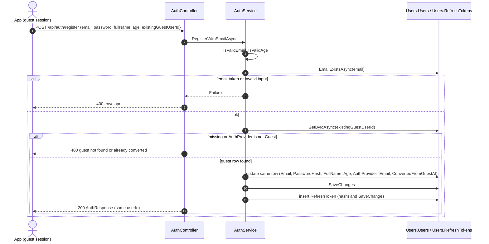

---

### Email login

- **Purpose:** sign in an existing email/password account and start a session.
- **Actors:** registered user with `AuthProvider = "Email"` (including a guest upgraded by email).
- **Trigger / entry endpoint(s):** `POST /api/auth/login` with body `{ email, password }`.
- **Preconditions:** the account exists and has a password hash.
- **Flow (`AuthService.LoginWithEmailAsync`):**
  1. Validate the email format.
  2. Load the user by exact email (`UserRepository.GetByEmailAsync`).
  3. Fail with one generic message if the user is missing, has no `PasswordHash` (a Google or guest account), or the BCrypt check fails.
  4. Fail if `IsActive = false`.
  5. Issue tokens: insert into `Users.RefreshTokens` and commit.
- **Business rules:**
  - Unknown email, wrong password and password-less accounts all give the same message, so the response doesn't reveal which one it was (`LoginWithEmailAsync`).
  - The inactive-account message is returned only after the password has been verified (`LoginWithEmailAsync`).
  - Each login adds a new refresh token. Earlier tokens stay valid, so sessions on several devices coexist (`IssueTokensAsync`).
  - No lockout, attempt counter or rate limit (none registered in `Program.cs`).
  - Email matching is an exact equality in LINQ; case sensitivity follows the database collation.
- **Outcomes & failures:** every failure is **401**.

  | Status | Message | Meaning |
  |---|---|---|
  | 200 | `"تم تسجيل الدخول بنجاح"` | logged in, with `AuthResponse` |
  | 401 | `"صيغة الإيميل غير صحيحة"` | invalid email format |
  | 401 | `"بيانات الدخول غير صحيحة"` | invalid credentials |
  | 401 | `"الحساب غير مفعّل"` | account not active |

---

### Google sign-in

- **Purpose:** one endpoint that logs in an existing Google user, upgrades a guest, or creates a new Google account.
- **Actors:** app user; Google, which issues the ID token.
- **Trigger / entry endpoint(s):** `POST /api/auth/google` with body `{ idToken, role?, existingGuestUserId? }`.
- **Preconditions:** the app got a Google ID token for the OAuth client configured as `Google:ClientId`.
- **Flow (`AuthService.LoginOrRegisterWithGoogleAsync`):**
  1. `Shared.Users.GoogleAuthValidator.ValidateAsync` calls `GoogleJsonWebSignature.ValidateAsync` with `Audience = Google:ClientId`.
     - An `InvalidJwtException` returns `null`, which fails the request.
     - On success it yields `(ProviderUserId = sub, Email, FullName = name)`.
  2. Look up `Users.Users` by `(AuthProvider = "Google", ProviderUserId = sub)`.
     - If found and inactive, fail.
     - If found and active, issue tokens and return. This is a login.
  3. If not found and `existingGuestUserId` is present, run the guest upgrade (previous process).
  4. Otherwise create a new user:
     - `Email = google email`, `FullName = google name ?? google email`
     - `Role = NormalizeRole(role)`
     - `AuthProvider = "Google"`, `ProviderUserId = sub`
     - `IsActive = true`, `Age = null`
  5. Insert and commit, then issue tokens (a second commit).
  6. The app is expected to show an age screen next and call `PATCH /api/auth/age`, as the `AuthController.SetAge` XML comment says.
- **Business rules:**
  - A Google account is matched **only by Google subject id**, never by email. A Google login whose email matches an existing *Email* account does not link to it (`LoginOrRegisterWithGoogleAsync`).
  - Creating a Google user doesn't check email uniqueness. An email already used by another row breaks `UQ_Users_Email` and returns 500 (`LoginOrRegisterWithGoogleAsync`).
  - `role` is used only when a brand-new account is created; login and upgrade ignore it.
  - Google's `email_verified` isn't checked (`GoogleAuthValidator.ValidateAsync` returns `payload.Email` as is).
  - Only `InvalidJwtException` becomes a clean 400. Other validator exceptions, such as failing to fetch Google's signing keys, return 500.
- **Outcomes & failures:**
  - 200 `"تم الدخول عن طريق Google بنجاح"` (signed in with Google) with `AuthResponse` (`age` is `null` for new accounts).
  - 400 `"Google Token غير صالح"` (invalid Google token), `"الحساب غير مفعّل"` (account not active), or `"حساب الـ Guest غير موجود أو اتحول قبل كده"` (guest not found or already converted).
  - 500 on email collision.

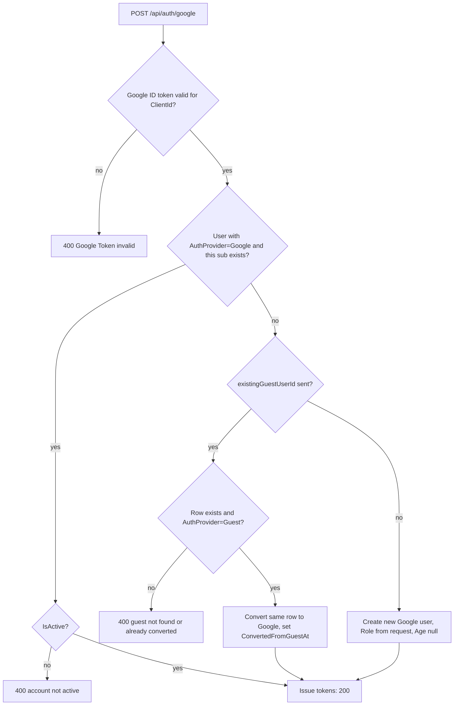

---

### Token issuance and session lifecycle (refresh rotation, logout)

- **Purpose:** keep a user signed in with short-lived access tokens and long-lived, rotating refresh tokens, and let them end a session.
- **Actors:** any signed-in client.
- **Trigger / entry endpoint(s):**
  - Issuance happens inside guest creation, registration, login and Google sign-in.
  - `POST /api/auth/refresh` with body `{ refreshToken }` (anonymous).
  - `POST /api/auth/logout` with body `{ refreshToken }` (requires a valid access token).
- **Preconditions:** refresh needs a refresh token the server issued. Logout also needs a valid, unexpired access token in `Authorization: Bearer`.
- **Flow — issuance (`AuthService.IssueTokensAsync`):**
  1. `JwtTokenGenerator.GenerateAccessToken` signs an HS256 JWT.
     - Claims: `sub` = user id, role (`ClaimTypes.Role`), `authProvider`, `jti`.
     - Lifetime: `Jwt:AccessTokenExpirationMinutes`, default 15.
  2. `GenerateRefreshTokenValue` creates 64 random bytes (`RandomNumberGenerator`) as Base64.
  3. Only the **SHA-256 hex hash** is stored (`Sha256HashGenerator`): a `Users.RefreshTokens` row with `ExpiresAt = UtcNow + 30 days`, then commit.
  4. The plaintext refresh token is returned once in `AuthResponse`.
- **Flow — refresh (`AuthService.RefreshTokenAsync`):**
  1. Hash the incoming token and load the row by hash.
  2. The row is usable only if it exists, `RevokedAt` is null and `ExpiresAt > now`. Otherwise fail.
  3. Mark the row `RevokedAt = now` (rotation).
  4. Load the user. If missing or inactive, fail. This happens before any commit, so the revocation is **not** saved in that case.
  5. Commit the revocation, then issue a fresh access + refresh pair (a second commit). The new tokens reflect the user's **current** role and provider from the database.
- **Flow — logout (`AuthService.LogoutAsync`):**
  1. `[Authorize]` requires a valid access token.
  2. Hash the body token and load the row. If missing, fail.
  3. Set `RevokedAt = now`, even if it was already revoked or expired, and commit.
- **Business rules:**
  - Refresh tokens are single-use: every successful refresh revokes the one presented (`RefreshTokenAsync`).
  - Refresh token lifetime is **hard-coded to 30 days** in `IssueTokensAsync`. `JwtSettings.RefreshTokenExpirationDays` exists but nothing reads it.
  - Access tokens are stateless. Logout and deactivation don't invalidate an access token already issued; it works until it expires. The JWT bearer handler's default clock skew applies, since `Program.cs` doesn't override it.
  - Logout doesn't check that the refresh token belongs to the caller identified by the access token (`LogoutAsync`).
  - Revoking the old token and saving the new one are separate commits. Nothing guards concurrency: there is no concurrency token on `RefreshToken` (`UsersDbContext`). Two simultaneous refreshes with the same token can both pass the "not revoked" check.
  - Expired or revoked rows are never deleted.
  - `RefreshTokens` rows cascade-delete with the user (`FK_RefreshTokens_Users ON DELETE CASCADE` in the database script).
- **Outcomes & failures:**

  | Endpoint | Status | Message | Meaning |
  |---|---|---|---|
  | refresh | 200 | `"تم تجديد التوكن بنجاح"` | token refreshed, with a new `AuthResponse`; the client must replace **both** tokens |
  | refresh | 401 | `"Refresh Token غير صالح أو منتهي"` | refresh token invalid or expired |
  | refresh | 401 | `"المستخدم غير موجود أو غير مفعّل"` | user not found or inactive |
  | logout | 200 | `"تم تسجيل الخروج بنجاح"` | logged out |
  | logout | 400 | `"Token غير موجود"` | token not found |
  | logout | 401 | `"غير مصرح لك بالوصول"` | missing or expired access token |

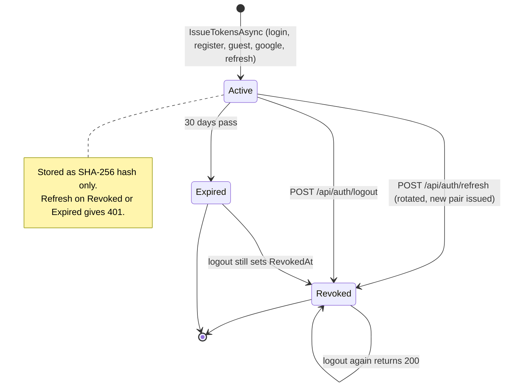

---

### Password reset (forgot password → verify OTP → reset)

- **Purpose:** let an email/password user set a new password using a 6-digit code sent by email, without being signed in.
- **Actors:** anonymous user; the SMTP server.
- **Trigger / entry endpoint(s):**
  1. `POST /api/auth/forgot-password` `{ email }`
  2. `POST /api/auth/verify-reset-otp` `{ email, otp }`
  3. `POST /api/auth/reset-password` `{ email, resetToken, newPassword }`
- **Preconditions:** the account exists with `AuthProvider = "Email"`. SMTP is configured under `EmailSettings`.
- **Flow — step 1 (`AuthService.ForgotPasswordAsync`):**
  1. Load the user by email. If there is none, or the provider isn't `"Email"`, return success without doing anything.
  2. Generate the code: `Random.Shared.Next(100000, 999999)`.
  3. Delete this user's existing **usable** OTPs from `Users.PasswordResetOTPs`, meaning not verified and not expired (`PasswordResetOtpRepository.DeleteAllUsableForUserAsync`).
  4. Insert a new row: `OTPHash = SHA-256(code)`, `ExpiresAt = now + 15 min`, `Attempts = 0`. Commit.
  5. Send an HTML email with subject `"كود إعادة تعيين كلمة المرور - ElectroWorld"` (password reset code) through `SmtpEmailSender`.
     - If sending throws, the exception is swallowed and the **plaintext OTP is written to the console** (`Console.WriteLine`), and the request still succeeds.
- **Flow — step 2 (`AuthService.VerifyResetOtpAsync`):**
  1. Load the user by email, any provider. If missing, fail.
  2. Load the newest usable OTP: `VerifiedAt` null and `ExpiresAt > now` (`GetLatestUsableForUserAsync`). If there is none, or `Attempts >= 5`, fail.
  3. Compare hashes. On mismatch, `Attempts += 1`, commit, and fail.
  4. On match:
     - generate a reset token (64 random bytes, Base64)
     - set `VerifiedAt = now`, `ResetTokenHash = SHA-256(token)`, `ResetTokenExpiresAt = now + 10 min`
     - commit and return `{ resetToken, resetTokenExpiresAt }`
- **Flow — step 3 (`AuthService.ResetPasswordAsync`):**
  1. Load the user by email. If missing, fail.
  2. Find the OTP row for this user whose `ResetTokenHash` matches and whose `ResetTokenExpiresAt > now` (`GetByResetTokenHashAsync`). If there is none, fail.
  3. Set `PasswordHash = BCrypt(newPassword)` on `Users.Users`.
  4. Clear `ResetTokenHash` and `ResetTokenExpiresAt` (single use). Commit once: user and OTP row in the same `SaveChanges`.
- **Business rules:**
  - Step 1 always returns 200 with the same message, so it can't be used to find out which emails are registered. That includes Google and guest accounts, which never get a code (`ForgotPasswordAsync`, `AuthController.ForgotPassword`).
  - A new request invalidates every earlier **unverified** code by deleting it. A code already verified, with its reset token still live, is not deleted (`DeleteAllUsableForUserAsync`).
  - A code lives 15 minutes and a reset token 10 minutes (`ForgotPasswordAsync`, `VerifyResetOtpAsync`).
  - Five wrong guesses lock a code: from then on even the correct code is refused until a new one is requested. Requesting a new code starts a fresh counter (`VerifyResetOtpAsync`, `Attempts >= 5`).
  - A code can be verified once. After verification it is no longer "usable", so verifying again returns the expired message (`GetLatestUsableForUserAsync` filters `VerifiedAt == null`).
  - The reset token is single-use and tied to the email's user (`ResetPasswordAsync`, `GetByResetTokenHashAsync`).
  - The code comes from `System.Random` (`Random.Shared`), not a cryptographic RNG. The upper bound is exclusive, so codes range over 100000–999998.
  - Resetting the password **doesn't revoke** existing refresh tokens (`ResetPasswordAsync`), and there are no password rules.
  - The expiry checks in `PasswordResetOtpRepository` use `DateTime.UtcNow` directly, not `IDateTimeProvider`.
  - No rate limit on any of the three endpoints.
- **Outcomes & failures:**

  | Step | Status | Message | Meaning |
  |---|---|---|---|
  | 1 | 200 | `"لو الإيميل مسجل، هيوصلك كود إعادة التعيين"` | if the email is registered, a reset code will arrive (always) |
  | 2 | 200 | `"الكود صحيح"` | code correct, with `{ resetToken, resetTokenExpiresAt }` |
  | 2 | 400 | `"بيانات غير صحيحة"` | invalid data: unknown email |
  | 2 | 400 | `"الكود منتهي أو غير صالح، اطلبي كود جديد"` | code expired or invalid, request a new one: none usable, or locked after 5 attempts |
  | 2 | 400 | `"الكود غير صحيح"` | wrong code; the attempt is counted |
  | 3 | 200 | `"تم تغيير كلمة المرور بنجاح"` | password changed |
  | 3 | 400 | `"بيانات غير صحيحة"` | invalid data: unknown email |
  | 3 | 400 | `"جلسة إعادة التعيين منتهية أو غير صالحة، ابدئي من كود جديد"` | reset session expired or invalid, start again with a new code |

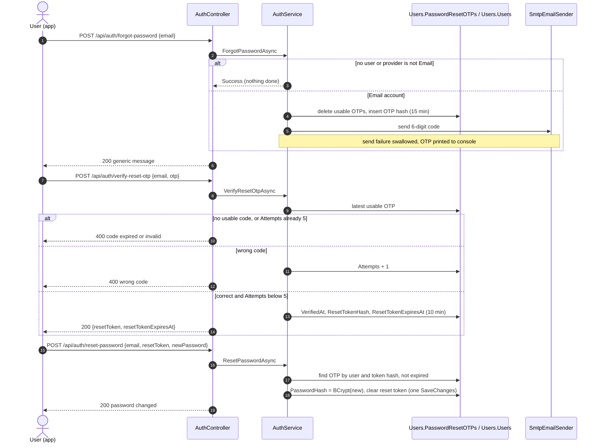

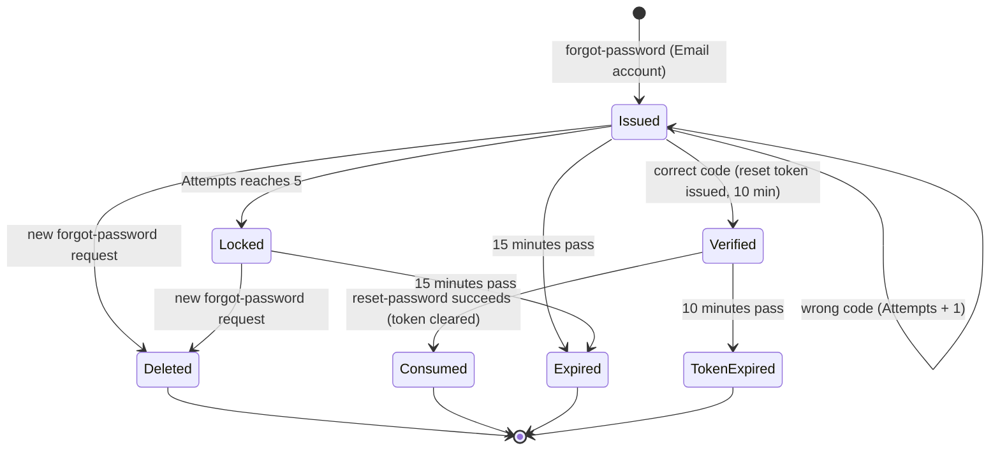

---

### Age capture after sign-in

- **Purpose:** record the learner's age after a flow that didn't collect it (typically Google sign-in, or a guest). The age is used to pitch AI hints at the child's level.
- **Actors:** any signed-in user: guests, children, parents, admins.
- **Trigger / entry endpoint(s):** `PATCH /api/auth/age` with body `{ age }` (requires an access token).
- **Preconditions:** a valid access token whose `sub` matches an existing user.
- **Flow (`UserService.SetAgeAsync`):**
  1. The user id is taken from the token (`User.GetUserId()`), never from the body.
  2. Load the user. If missing, fail.
  3. Check the age is 7–18. `age` is a non-nullable `int`, so a missing value binds as 0 and fails this check.
  4. Set `Users.Users.Age` and commit.
  5. Return `UserProfileResponse`.
- **Business rules:**
  - The age must be between 7 and 18 inclusive, for every role (`UserService.IsValidAge`).
  - The age can be changed any number of times.
  - Side effect: Assessment reads the age only through the Shared contract `ILearnerProfile`, implemented by `UsersBL.Services.LearnerProfileService.GetAgeAsync`. It is used in AI hint requests (`AssessmentBL.Services.HintService`, `QuizAttemptService`). Only the age is exposed, never name, email or provider.
- **Outcomes & failures:**
  - 200 `"تم تحديث السن بنجاح"` (age updated) with `UserProfileResponse`.
  - 400 `"السن لازم يكون بين 7 و 18 سنة"` (age must be 7–18) or `"المستخدم غير موجود"` (user not found).
  - 401 without a valid token.

---

### Profile read and update

- **Purpose:** show the signed-in user's own profile and let them change their display name and age.
- **Actors:** any signed-in user.
- **Trigger / entry endpoint(s):**
  - `GET /api/users/me`
  - `PUT /api/users/me` with body `{ fullName, age? }`
- **Preconditions:** a valid access token.
- **Flow:**
  1. `UsersController` takes the user id from the token.
  2. Read: `UserService.GetProfileAsync` loads `Users.Users` by id and maps it to `UserProfileResponse { id, email, fullName, role, authProvider, age, isActive, convertedFromGuestAt, createdAt }`.
  3. Update: `UserService.UpdateProfileAsync` loads the user and validates the age (null, or 7–18). It sets `FullName` and `Age`; a null `age` **clears** the stored age. Then it commits and returns the updated profile.
- **Business rules:**
  - A user can only read or change their own row; the id always comes from the token (`UsersController`).
  - Only `FullName` and `Age` are editable. Email, role, provider and active flag can't be changed through the API (`UserService.UpdateProfileAsync`).
  - `IsActive` isn't checked here. A deactivated user with an unexpired access token can still read and update the profile (`UserService`).
  - No validation on `fullName` beyond model binding: an empty string is accepted, and over 150 characters gives a 500.
- **Outcomes & failures:**
  - `GET /api/users/me`:
    - 200 `"تمت العملية بنجاح"` (operation succeeded) with the profile
    - **404** `"المستخدم غير موجود"` (user not found: token valid, row gone)
  - `PUT /api/users/me`:
    - 200 `"تم تحديث البيانات بنجاح"` (profile updated)
    - **400** for both `"المستخدم غير موجود"` (user not found) and `"السن لازم يكون بين 7 و 18 سنة"` (age must be 7–18)
  - Both return 401 without a valid token.

---

### Roles, account status and parent–child links

- **Purpose:** explain who may do what, and which account-level states exist.
- **Actors:** Child, Parent, Admin; database operators.
- **Trigger / entry endpoint(s):** role checks run on every `[Authorize(Roles = ...)]` endpoint. No endpoint manages roles, activation or links.
- **Preconditions:** none.
- **Flow:**
  1. The role is stored in `Users.Users.Role` and copied into the access token at issue time (`AuthService.IssueTokensAsync` → `JwtTokenGenerator`).
  2. ASP.NET Core authorization compares the token's role claim with the `Roles` of the endpoint. A mismatch returns 403 with the envelope (`ApiResponseAuthWriter.OnForbidden`).
- **Business rules:**
  - Roles a user can obtain through the API: `Child` (default) and `Parent` (`AuthService.NormalizeRole`). The code defines only these two constants (`UsersBL.UserRoles`).
  - **Admin can't be obtained through any endpoint.** The Content and Assessment authoring endpoints require it. The role CHECK constraint in the database script accepts `Admin`, `Child` and `Parent` (`CK_Users_Role` in `DatabaseScripts/Users.sql` at git HEAD, deleted from the working tree), so admin accounts must be set directly in the database.
  - Where roles are enforced: see the role table in section 6 (*Request pipeline and authentication*). In short, Content writes, image upload and Assessment authoring are Admin only; the placement endpoints are Child only; everything else behind `[Authorize]` accepts any authenticated user.
    No endpoint is restricted to `Parent`, and there are no Parent-specific features.
  - A role changed in the database takes effect when the next token is issued (login or refresh), because the claim is copied at issue time.
  - `IsActive` is only checked at email login, Google login and refresh (`AuthService`). No endpoint changes it. Access tokens already issued keep working until they expire.
  - **Parent–child links aren't implemented as a flow.** `Users.ParentChildLinks` is mapped in `UsersDbContext`: unique `(ParentUserId, ChildUserId)`, and the script also has a no-self-link CHECK. No repository, service or endpoint reads or writes it.
  - No endpoint deletes a user.
- **Outcomes & failures:**
  - 403 `"ليس لديك صلاحية"` (you do not have permission) when the role doesn't match.
  - 401 `"غير مصرح لك بالوصول"` (you are not authorized) when the token is missing, invalid or expired.

---

## 4. Content module

The learning catalogue: `ContentBL`, `ContentDA`, exposed by `ElectroWorld/Controllers/Content/*` under `/api/content`. All endpoints require a token; every write requires Admin. Levels, lessons and lesson contents live in schema `LearningContent`. Assessment reaches this module only through `ILevelCatalog` and `ILessonAvailability`.

### Browsing the learning catalogue (levels, lessons, lesson contents, content types)

- **Purpose:** give the app the ordered list of levels, each level's lessons, and a lesson's content blocks for display.
- **Actors:** any signed-in user (Child, Parent, Admin, including guests).
- **Trigger / entry endpoint(s):**
  - `GET /api/content/levels`
  - `GET /api/content/levels/{id}`
  - `GET /api/content/levels/{levelId}/lessons`
  - `GET /api/content/lessons/{id}`
  - `GET /api/content/content-types`
- **Preconditions:** a valid access token. All Content controllers carry `[Authorize]`.
- **Flow:**
  1. Levels: `LevelService.GetAllAsync` reads `LearningContent.Levels` sorted by `Order` ascending. `GetByIdAsync` reads one level.
  2. Lessons of a level: `LessonService.GetByLevelIdAsync` reads `LearningContent.Lessons` where `LevelId` matches, sorted by `SortOrder`.
  3. Lesson detail: `LessonService.GetDetailAsync` loads the lesson with its `LessonContents`, sorted by `SortOrder`, plus each content's `ContentType` name (`LessonRepository.GetWithContentsAsync`).
  4. Content types: `ContentTypeService.GetAllAsync` reads `LearningContent.ContentTypes` sorted by `Id`.
  5. Image URLs in `mediaUrl` are server-relative (e.g. `/uploads/lessons/<guid>.png`). They are fetched straight from static files (see *Media upload*).
- **Business rules:**
  - Reads don't filter on publication. Unpublished lessons and their contents are returned to every signed-in user, children included; the response carries `isPublished` (`LessonService.GetByLevelIdAsync`, `GetDetailAsync`). Publication is enforced only for quizzes (see *Lesson publication and quiz gating*).
  - An unknown level id on the lessons list returns an empty list, not an error (`LessonService.GetByLevelIdAsync`).
  - Levels have no published flag; every level is always visible (`ContentDA.Entities.Level`).
  - Content types are a lookup table the API never modifies; no endpoint creates them.
- **Outcomes & failures:**
  - 200 `"تمت العملية بنجاح"` (operation succeeded) with data.
  - `GET /api/content/levels/{id}`: 404 `"المستوى غير موجود"` (level not found).
  - `GET /api/content/lessons/{id}`: 404 `"الدرس غير موجود"` (lesson not found).
  - 401 without a token.

---

### Level management (create, update, delete)

- **Purpose:** let admins maintain the ordered list of levels that structures lessons and the placement test.
- **Actors:** Admin.
- **Trigger / entry endpoint(s):**
  - `POST /api/content/levels` `{ title, description? }`
  - `PUT /api/content/levels/{id}` `{ title, description? }`
  - `DELETE /api/content/levels/{id}`
  - Reordering: see *Reordering by swap*.
- **Preconditions:** an Admin token. Update and delete need an existing level. Delete needs no lessons in the level.
- **Flow:**
  1. **Create** (`LevelService.CreateAsync`):
     - `Order = (max Order across all levels, or 0) + 1`
     - insert into `LearningContent.Levels` and commit
  2. **Update** (`LevelService.UpdateAsync`): load the level, set `Title` and `Description`, commit. `Order` isn't touched.
  3. **Delete** (`LevelService.DeleteAsync`):
     - load the level, remove it, commit
     - `FK_Lessons_Levels` (`DeleteBehavior.Restrict`) makes the commit fail if lessons still belong to the level
     - the resulting `DbUpdateException` is caught and turned into a business message
- **Business rules:**
  - New levels always go to the end, and the client can't set `Order` (`LevelService.CreateAsync`, `CreateLevelRequest` has no order).
  - Update never changes order (`LevelService.UpdateAsync`).
  - A level with lessons can't be deleted; delete its lessons first. **Any** `DbUpdateException` on this commit gets that same message (`LevelService.DeleteAsync`).
  - Deleting a level doesn't renumber the others, so gaps in `Order` remain.
  - Next-order values are computed as max + 1 without a lock or unique constraint, so concurrent creates can get the same `Order`.
  - Cross-module effects:
    - `Assessment.Quizzes.LevelId` and `Assessment.UserPlacements.PlacedLevelId` point at levels **without a foreign key** (`db/migrations/000_AssessmentSchema.sql` header). Deleting a level doesn't check or clean them up.
    - The placement test reads levels only through `ILevelCatalog` (`ContentBL.Services.LevelCatalogService.GetLevelsInOrderAsync`). `PlacementEngine.SelectQuestionIdsAsync` keeps only quizzes of levels that still exist, so a deleted level's LevelAssessment quiz drops out of placement.
    - Creating a quiz with a `levelId` that doesn't exist is refused (a quiz's level cannot be changed after creation) by `QuizService.EnsureReferenceExistsAsync` (404 `"المستوى رقم {id} غير موجود"`, level {id} not found).
- **Outcomes & failures:**

  | Endpoint | Status | Message | Meaning |
  |---|---|---|---|
  | create | 200 | `"تم إنشاء المستوى بنجاح"` | level created. No service failure path; over-length title gives 500 |
  | update | 200 | `"تم تعديل المستوى بنجاح"` | level updated |
  | update | 400 | `"المستوى غير موجود"` | level not found |
  | delete | 200 | `"تم مسح المستوى بنجاح"` | level deleted |
  | delete | 400 | `"المستوى غير موجود"` | level not found |
  | delete | 400 | `"مينفعش تمسحي المستوى ده لأن فيه دروس مرتبطة بيه، امسحي الدروس الأول"` | can't delete this level because lessons are linked to it; delete the lessons first |
  | all | 403 | | non-admin |
  | all | 401 | | no token |

---

### Lesson management (create, update / move, delete)

- **Purpose:** let admins author lessons inside a level, move them between levels, and remove them together with their content.
- **Actors:** Admin.
- **Trigger / entry endpoint(s):**
  - `POST /api/content/lessons` `{ levelId, title, description? }`
  - `PUT /api/content/lessons/{id}` `{ levelId, title, description? }`
  - `DELETE /api/content/lessons/{id}`
- **Preconditions:** an Admin token. The target level exists. For update and delete, the lesson exists.
- **Flow:**
  1. **Create** (`LessonService.CreateAsync`):
     - check the level exists
     - `SortOrder = (max SortOrder in that level, or 0) + 1`
     - insert into `LearningContent.Lessons` with `IsPublished = false`, `CreatedAt = UtcNow`
     - commit
  2. **Update** (`LessonService.UpdateAsync`):
     - load the lesson, check the target level exists
     - set `Title` and `Description`
     - if `levelId` differs from the current one, set `SortOrder = (max SortOrder in the new level) + 1` and change `LevelId`
     - commit
  3. **Delete** (`LessonService.DeleteAsync`):
     - load the lesson and all its `LessonContents`
     - for each content, delete its image file from disk (`LocalImageStorageService.DeleteImage`; only URLs under `/uploads/lessons/`)
     - remove the content rows and the lesson row, and commit them **together in one `SaveChanges`**
- **Business rules:**
  - A new lesson is always a draft (`IsPublished = false`) and goes to the end of its level (`LessonService.CreateAsync`).
  - Editing never changes order, except that moving to another level puts the lesson at the end of the new level. The old level keeps a gap. The published flag is unchanged by a move (`LessonService.UpdateAsync`).
  - A lesson can be deleted whether or not it is published, and its contents are deleted with it (`LessonService.DeleteAsync`).
  - Image files are deleted **before** the database commit. If the commit fails, the files are already gone (`LessonService.DeleteAsync`).
  - Cross-module effects:
    - `Assessment.Quizzes.LessonId` has no foreign key. Deleting a lesson leaves its quizzes in place.
    - Afterwards `ILessonAvailability.IsPublishedAsync` returns `null` for that id. `GET /api/quizzes/for-lesson/{lessonId}` and starting an attempt on the quiz then return 404 (see next process).
    - Creating a quiz for a lesson id that doesn't exist is refused (a quiz's lesson cannot be changed after creation) by `QuizService.EnsureReferenceExistsAsync` (404 `"الدرس رقم {id} غير موجود"`, lesson {id} not found). An unpublished lesson is allowed there, so a quiz can be authored before release.
- **Outcomes & failures:**

  | Endpoint | Status | Message | Meaning |
  |---|---|---|---|
  | create | 200 | `"تم إنشاء الدرس بنجاح"` | lesson created |
  | create | 400 | `"المستوى المحدد غير موجود"` | selected level not found |
  | update | 200 | `"تم تعديل الدرس بنجاح"` | lesson updated |
  | update | 400 | `"الدرس غير موجود"` | lesson not found |
  | update | 400 | `"المستوى المحدد غير موجود"` | selected level not found |
  | delete | 200 | `"تم مسح الدرس بنجاح"` | lesson deleted |
  | delete | 400 | `"الدرس غير موجود"` | lesson not found |
  | all | 403 / 401 | | as usual |

---

### Lesson publication and quiz gating

- **Purpose:** control when a lesson is released to learners. Publication is what decides whether the lesson's quiz can be looked up or started.
- **Actors:** Admin (publishes or hides); Child (affected); Assessment module (asks).
- **Trigger / entry endpoint(s):**
  - `PATCH /api/content/lessons/{id}/publish` with body `{ isPublished }`
  - Gate consumers: `GET /api/quizzes/for-lesson/{lessonId}` and `POST /api/quiz-attempts?quizId=…` (first attempt and retry)
- **Preconditions:** an Admin token for the toggle. The lesson exists.
- **Flow:**
  1. `LessonService.SetPublishedAsync` loads the lesson, sets `IsPublished` to the requested value, commits, and returns the lesson summary.
  2. When a child asks for a lesson's quiz, `QuizService.GetForLessonAsync` calls the Shared contract `ILessonAvailability.IsPublishedAsync(lessonId)`, implemented by `ContentBL.Services.LessonAvailabilityService`. It returns `null` if the lesson doesn't exist, otherwise the flag. Anything other than `true` throws `KeyNotFoundException`, which gives 404.
  3. When an attempt is started, `QuizAttemptService.StartAsync` loads the quiz. If it has a `LessonId` and `IsPublishedAsync` isn't `true`, it throws `KeyNotFoundException`, which gives 404. This runs before the placement, first-attempt and retry branches, so retries are gated too.
  4. Quiz selection and attempt rules after the gate are described in the Assessment flows.
- **Business rules:**
  - Publishing has no preconditions: an empty lesson, or one without a quiz, can be published. Setting the same value again succeeds (`LessonService.SetPublishedAsync`).
  - To a child, an unpublished lesson looks exactly like a missing one: the same 404 path (`QuizService.GetForLessonAsync`, `QuizAttemptService.StartAsync`).
  - Only **starting** an attempt and the **for-lesson lookup** check publication. Hiding a lesson doesn't affect attempts already started: in the Assessment services, the only calls to `IsPublishedAsync` are in `StartAsync`, `GetForLessonAsync` and quiz authoring.
  - Quiz authoring (`QuizService.EnsureReferenceExistsAsync`) only requires the lesson to exist, not to be published.
  - Lesson and lesson-content read endpoints ignore the flag (see *Browsing the learning catalogue*).
- **Outcomes & failures:**
  - Toggle:
    - 200 `"تم نشر الدرس"` (lesson published) or `"تم إخفاء الدرس"` (lesson hidden), with the summary
    - 400 `"الدرس غير موجود"` (lesson not found)
    - 403 for non-admin, 401 without a token
  - For-lesson lookup on an unpublished or missing lesson: 404 `"الدرس رقم {lessonId} غير موجود"` (lesson {id} not found).
  - Start on such a lesson's quiz: 404 `"الاختبار رقم {quizId} غير متاح"` (quiz {id} not available).

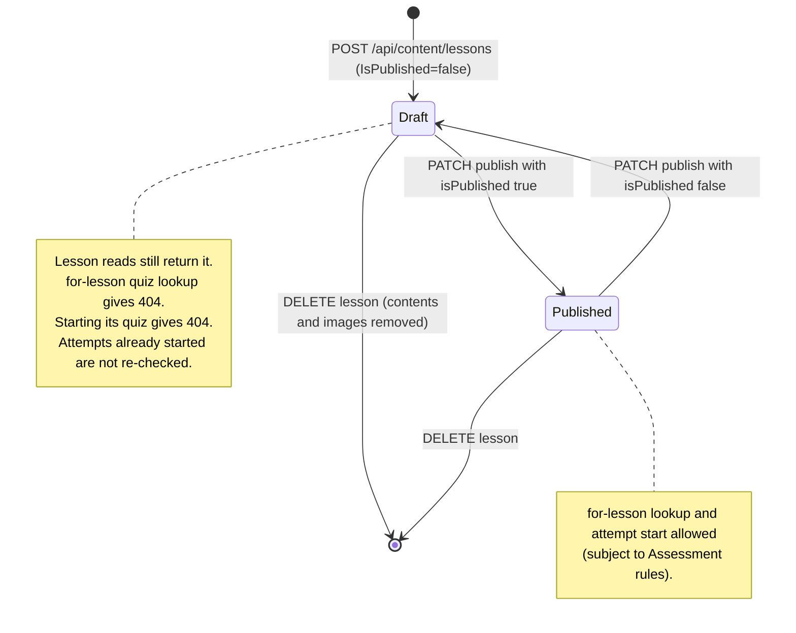

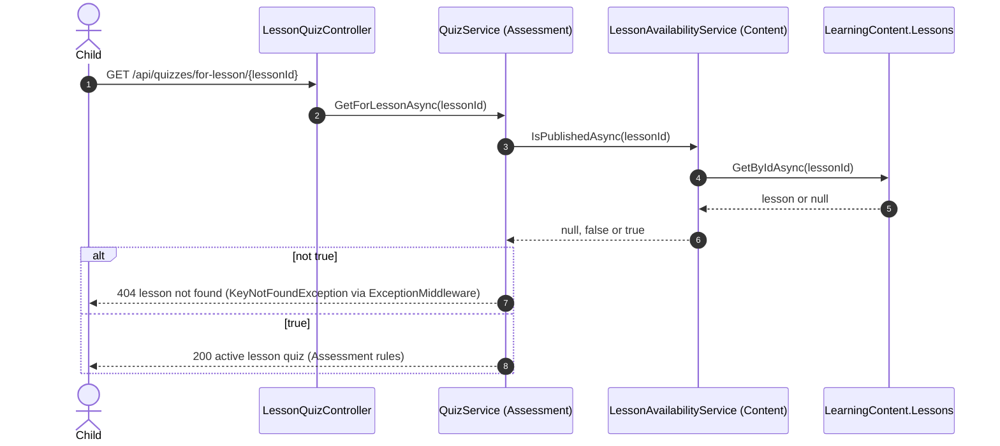

---

### Lesson content management (create, update, delete)

- **Purpose:** let admins build a lesson from ordered blocks of text and/or image.
- **Actors:** Admin.
- **Trigger / entry endpoint(s):**
  - `POST /api/content/lessons/{lessonId}/contents` `{ contentTypeId, content?, mediaUrl? }`
  - `PUT /api/content/contents/{contentId}` `{ contentTypeId, content?, mediaUrl? }`
  - `DELETE /api/content/contents/{contentId}`
- **Preconditions:** an Admin token. For an image block, upload the image first with `POST /api/content/media/images` and send the returned `url` as `mediaUrl`.
- **Flow:**
  1. **Create** (`LessonContentService.CreateAsync`):
     - check the lesson exists and the content type exists
     - require non-blank `content` or non-blank `mediaUrl`
     - `SortOrder = (max SortOrder in the lesson, or 0) + 1`
     - insert into `LearningContent.LessonContents` and commit
     - return the block with its content type name, looked up from `ContentTypes`
  2. **Update** (`LessonContentService.UpdateAsync`):
     - load the block, check the content type exists, require text or media
     - if `mediaUrl` differs from the stored one, delete the **old** image file from disk
     - set `ContentTypeId`, `Content` and `MediaUrl`, and commit
  3. **Delete** (`LessonContentService.DeleteAsync`): load the block, delete its image file, remove the row, commit.
- **Business rules:**
  - Every block needs text or an image (whitespace-only counts as empty) (`LessonContentService.HasBody`).
  - `contentTypeId` must exist in `ContentTypes`. The type's meaning isn't enforced: a `Text`-named type with only an image is accepted (`CreateAsync`, `UpdateAsync`).
  - New blocks go last in their lesson. Update never changes order or lesson; `LessonId` isn't in the update request (`CreateAsync`, `UpdateAsync`).
  - `mediaUrl` isn't validated as an upload. Any string up to 500 characters is stored. Only URLs starting with `/uploads/lessons/` are ever deleted from disk; external URLs are left alone (`LocalImageStorageService.DeleteImage`).
  - The old file is deleted **before** the commit, on update and on delete. If the commit fails, the file is already gone (`UpdateAsync`, `DeleteAsync`).
  - Assessment question images are uploaded through the same endpoint into the same folder (doc comment of `CreateQuestionDto.ImageUrl` in `AssessmentBL/DTOs/Question/AdminCreateQuestionRequestDto.cs`). If the same URL is reused in a lesson block and a question, changing or deleting the block deletes the file the question still points to.
  - Deleting a block doesn't renumber the rest.
- **Outcomes & failures:**

  | Endpoint | Status | Message | Meaning |
  |---|---|---|---|
  | create | 200 | `"تم إضافة المحتوى بنجاح"` | content added |
  | create | 400 | `"الدرس غير موجود"` | lesson not found |
  | create | 400 | `"نوع المحتوى غير موجود"` | content type not found |
  | create | 400 | `"لازم يكون في نص أو صورة على الأقل"` | there must be at least text or an image |
  | update | 200 | `"تم تعديل المحتوى بنجاح"` | content updated |
  | update | 400 | `"عنصر المحتوى غير موجود"` | content item not found |
  | update | 400 | `"نوع المحتوى غير موجود"` | content type not found |
  | update | 400 | `"لازم يكون في نص أو صورة على الأقل"` | there must be at least text or an image |
  | delete | 200 | `"تم مسح المحتوى بنجاح"` | content deleted |
  | delete | 400 | `"عنصر المحتوى غير موجود"` | content item not found |
  | all | 403 / 401 | | as usual |

---

### Reordering by swap (levels, lessons, lesson contents)

- **Purpose:** change display order without sending order numbers. Two items exchange positions.
- **Actors:** Admin.
- **Trigger / entry endpoint(s):**
  - `POST /api/content/levels/swap-order` `{ firstLevelId, secondLevelId }`
  - `POST /api/content/lessons/swap-order` `{ firstLessonId, secondLessonId }`
  - `POST /api/content/contents/swap-order` `{ firstContentId, secondContentId }`
- **Preconditions:** an Admin token. Both items exist. Lessons must share a level; contents must share a lesson.
- **Flow (`LevelService.SwapOrderAsync`, `LessonService.SwapOrderAsync`, `LessonContentService.SwapOrderAsync`):**
  1. Reject if both ids are the same.
  2. Load both items. Reject if either is missing.
  3. Lessons: reject if `LevelId` differs. Contents: reject if `LessonId` differs.
  4. Exchange the two `Order` / `SortOrder` values and commit both rows in one `SaveChanges`.
- **Business rules:**
  - Swapping is the **only** way to change order after creation. Create appends at the end; update leaves order alone, except when a lesson moves level (all three services).
  - Values are swapped as they are. Gaps or duplicate numbers are never normalized.
  - Levels have no grouping restriction; any two levels can be swapped.
  - Side effect of reordering levels: the placement test serves questions by level order and grades a finished placement against the **current** level order (`AssessmentBL.Services.PlacementEngine`, via `ILevelCatalog`). Reordering changes placement for later gradings and re-descriptions.
- **Outcomes & failures:** success is always 200 `"تم تبديل الترتيب بنجاح"` (order swapped).

  | Endpoint | Status | Message | Meaning |
  |---|---|---|---|
  | levels | 400 | `"مينفعش تبدلي ترتيب المستوى بنفسه"` | can't swap a level with itself |
  | levels | 400 | `"واحد من المستويين غير موجود"` | one of the two levels doesn't exist |
  | lessons | 400 | `"مينفعش تبدلي ترتيب الدرس بنفسه"` | can't swap a lesson with itself |
  | lessons | 400 | `"واحد من الدرسين غير موجود"` | one of the two lessons doesn't exist |
  | lessons | 400 | `"مينفعش تبدلي ترتيب درسين من مستويين مختلفين"` | can't swap lessons from different levels |
  | contents | 400 | `"مينفعش تبدلي ترتيب العنصر بنفسه"` | can't swap an item with itself |
  | contents | 400 | `"واحد من العنصرين غير موجود"` | one of the two items doesn't exist |
  | contents | 400 | `"مينفعش تبدلي ترتيب عنصرين من درسين مختلفين"` | can't swap items from different lessons |
  | all | 403 / 401 | | as usual |

---

### Media (image) upload and file lifecycle

- **Purpose:** store an image on the server and give back a URL that lesson contents and Assessment questions can reference.
- **Actors:** Admin; later any client that loads the image; the Assessment AI request builder.
- **Trigger / entry endpoint(s):** `POST /api/content/media/images`, `multipart/form-data` with a form field named `file`.
- **Preconditions:** an Admin token (class-level `[Authorize(Roles = "Admin")]` on `MediaController`). The body is at most 6 MB (`[RequestSizeLimit(6 * 1024 * 1024)]`).
- **Flow (`MediaController.UploadImage` → `LocalImageStorageService.SaveImageAsync`):**
  1. Reject an empty file.
  2. Reject files over 5 MB.
  3. Take the extension from the uploaded **file name**, lower-cased, and reject anything other than `.jpg`, `.jpeg`, `.png`, `.webp`.
  4. Resolve `wwwroot`. If it is missing, throw `InvalidOperationException`, which gives 500 (deliberate).
  5. Create `wwwroot/uploads/lessons/` if needed and write the file as `<new GUID><ext>`.
  6. Return `{ url: "/uploads/lessons/<guid><ext>" }`. No database row is written.
  7. The controller catches only `BusinessRuleException` and returns it as 400. Anything else goes to `ExceptionMiddleware`, which gives 500.
- **Business rules:**
  - The allowed types are checked by file-name extension only, not by content (`LocalImageStorageService.SaveImageAsync`).
  - Size: 5 MB in the service, 6 MB request limit on the endpoint (`SaveImageAsync`, `MediaController`).
  - Random GUID file names, so an upload can't guess or overwrite another file (`SaveImageAsync`).
  - Files are served by `UseStaticFiles()`, which runs **before** authentication in `Program.cs`, so an uploaded image can be fetched by URL **without a token**.
  - Uploads aren't linked to any record. A file never referenced, or one whose last reference was replaced outside the delete paths above, is never cleaned up.
  - Files are removed only when a lesson content that points to them is updated to another URL, deleted, or deleted together with its lesson (`LocalImageStorageService.DeleteImage`).
  - Assessment reuses the same folder. `LocalMediaContentReader.ReadImageAsync` reads files only under `/uploads/lessons/`, refuses paths that resolve outside it, and accepts only the four image types under a byte limit. It is used to send image bytes to the AI when `Assessment:AiSendImageContent` is true (false in `appsettings.json`).
- **Outcomes & failures:**
  - 200 `"تم رفع الصورة بنجاح"` (image uploaded) with `{ url }`.
  - 400 with one of:
    - `"الملف فاضي"` (the file is empty)
    - `"حجم الصورة أكبر من 5 ميجا"` (image larger than 5 MB)
    - `"امتداد الصورة غير مسموح - المسموح بس jpg, jpeg, png, webp"` (extension not allowed; only jpg, jpeg, png, webp)
  - 500 `"حدث خطأ داخلي في الخادم"` (internal server error) when `wwwroot` isn't configured or the disk write fails.
  - A missing `file` field, or a body over 6 MB, is rejected by the framework before the service runs.
  - 403 for non-admin, 401 without a token.

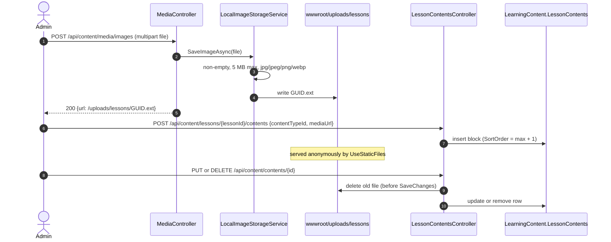

---

## 5. Assessment module

Quizzes, questions, attempts, placement, hints, AI essay grading and statistics: `AssessmentBL`, `AssessmentDA`, exposed by `ElectroWorld/Controllers/AssessmentModule/*`. All tables live in schema `Assessment` (`db/migrations/000_AssessmentSchema.sql`; existing databases are migrated by `db/migrations/001_points_ai_essays_image_descriptions.sql`, then `db/migrations/002_optional_topics_hint_level_uniqueness.sql`). Levels and lessons are reached only through `ILevelCatalog` and `ILessonAvailability` (no foreign key); the learner's age comes through `ILearnerProfile`.

Module-wide conventions (details in section 6):

- **Authentication.** Authoring endpoints (`/api/quizzes` admin actions, `/api/questions`, `/api/question-options`, `/api/assessment/categories`, `/api/assessment/topics`) need role `Admin`; `/api/placement` needs role `Child`; attempts, the lesson-quiz preview and topic statistics accept any authenticated role.
- **Response bodies.** A success is the DTO itself in camelCase, not wrapped; a failure is the envelope `{"success":false,"message":"…","data":null}`.
- **Language.** `?language=` → `Accept-Language` → `ar`, with field-by-field fallback requested → `en` → base column and a `languageFallbackApplied` flag.
- **What a child never sees.** Child-facing question and option DTOs never carry `IsCorrect`, `CorrectOptionId`, `ImageDescription` or `IsActive` (`LocalizedQuestionRow.ToDto`).
- **Points.** A question is worth `Points` (TINYINT > 0), 1 when the admin sends nothing or 0, frozen per attempt in `QuizAttemptQuestions.Points` at start. Score, an essay's `MaxPoints`, the placement decision and result totals all use the frozen value, never the live `Questions.Points`.

### Quiz authoring (create, update, activate)

- **Purpose:** Lets an admin define quizzes, bind each one to the right level or lesson by type, and control which quiz is live for each purpose.
- **Actors:** Admin.
- **Trigger / entry endpoint(s):** `POST /api/quizzes`, `PUT /api/quizzes/{quizId}`, `PATCH /api/quizzes/{quizId}/active?isActive=`, `GET /api/quizzes/{quizId}`, `GET /api/quizzes?quizType=&levelId=&lessonId=&isActive=&pageNumber=&pageSize=`.

**Preconditions:**
- The caller has role `Admin` (`QuizController` is `[Authorize(Roles = "Admin")]`).
- The referenced level or lesson already exists in the Content module.

**Flow — create** (`QuizService.CreateAsync`)
1. Trim the title. It must not be blank and must be at most 300 characters.
2. An empty or whitespace `quizType` becomes `Standalone`. Any other value must be one of `LevelAssessment | LessonQuiz | LessonReview | Standalone | Placement` (exact, case-sensitive). Omitting `quizType` or sending `null` never reaches the service: `CreateQuizDto.QuizType` is a non-nullable `string`, so the framework's automatic model validation answers 400 first (see *Response shapes*).
3. Check that the type matches its reference (`ValidateTypeMatchesReference`):
   - `LevelAssessment` needs `levelId` and no `lessonId`.
   - `LessonQuiz` and `LessonReview` need `lessonId` and no `levelId`.
   - `Standalone` and `Placement` need neither.
4. Check that the reference exists (`EnsureReferenceExistsAsync`). A lesson must exist, published or not, via `ILessonAvailability.IsPublishedAsync`. A level must be in `ILevelCatalog.GetLevelsInOrderAsync`.
5. Check the active slot, because a new quiz is created active (`EnsureSlotIsFreeAsync`). There may be only one active `Placement` quiz overall, and only one active `LessonQuiz` per lesson.
6. Insert into `Quizzes` with `IsActive = true` and `CreatedAt = now`. If two admins race, the filtered unique indexes `UQ_Quizzes_OneActivePlacement` and `UQ_Quizzes_OneActiveLessonQuizPerLesson` are translated to 409 (`SaveWithSlotConflictAsync`).
7. Return 201 with `QuizResponseDto` and a `Location` pointing at `GET /api/quizzes/{quizId}`.

**Flow — update** (`QuizService.UpdateAsync`)
1. Load the quiz, or return 404.
2. If the request turns the quiz on (`isActive` true while it is currently inactive), run the same slot check (step 5 above), excluding this quiz.
3. Overwrite `Title` (normalized), `Description`, `IsActive` and `UpdatedAt`. Save with the same unique-index translation.
4. Return 200 with `QuizResponseDto`.

**Flow — activate / deactivate** (`QuizService.SetActiveAsync`)
1. Load the quiz, or return 404. If the requested state equals the current one, return 204 without writing.
2. On activation, run the slot check. Then set `IsActive` and `UpdatedAt`, save, and return 204.

**Flow — read.** `GetByIdAsync` returns the quiz or 404. `GetAsync` filters by type, level, lesson and active flag. It pages with `pageNumber` (default 1, values below 1 become 1) and `pageSize` (default 20, clamped to 1…100), sorted by `Id` descending, and returns `{ items, totalCount, pageNumber, pageSize }` (`QuizFilterDto`, `PagedResult<T>`).

**Business rules:**
- `QuizType`, `LevelId` and `LessonId` cannot change after creation: they are not part of `UpdateQuizDto` (`QuizService.UpdateAsync`). The DB mirrors the binding rule with `CK_Quizzes_TypeMatchesReference`.
- `PUT /api/quizzes/{quizId}` always overwrites `IsActive`: `UpdateQuizDto.IsActive` is a plain `bool`, so a body that omits `isActive` deactivates the quiz (`QuizService.UpdateAsync`).
- There is at most one active Placement quiz and one active LessonQuiz per lesson (`QuizService.EnsureSlotIsFreeAsync` plus the filtered unique indexes). `LevelAssessment`, `LessonReview` and `Standalone` have no slot rule.
- A quiz may be bound to an unpublished lesson, so it can be authored before release (`QuizService.EnsureReferenceExistsAsync`).
- Activating a quiz does not require it to have active questions (no such check in `QuizService`).
- There is no delete endpoint for quizzes, and no endpoints for `QuizTranslations`, `QuestionTranslations` or `QuestionOptionTranslations`. Categories, topics and their translations have their own endpoints (see *Assessment category and topic authoring*).
- The authoring services never throw `InvalidOperationException` (pinned by `AuthoringServicesExceptionTests`).

**Outcomes & failures:**

| Status | When | Message (from code) |
|---|---|---|
| 201 / 200 / 204 | Create / update / activate succeeded | — |
| 400 | Title blank or longer than 300 | `عنوان الاختبار مطلوب` (title required) / `عنوان الاختبار لا يتجاوز 300 حرف` (title ≤ 300 chars) |
| 400 | Unknown type | `نوع الاختبار '{type}' غير صالح` (invalid quiz type) |
| 400 | Type does not match the level/lesson sent | `نوع الاختبار '{type}' لا يتوافق مع LevelId/LessonId المرسلة` |
| 404 | Quiz, lesson or level not found | `الاختبار رقم {id} غير موجود` / `الدرس رقم {id} غير موجود` / `المستوى رقم {id} غير موجود` |
| 409 | Another active Placement quiz exists | `يوجد اختبار تحديد مستوى مفعّل بالفعل، أوقفه أولًا` (deactivate it first) |
| 409 | Another active LessonQuiz exists for the lesson | `يوجد اختبار مفعّل بالفعل للدرس رقم {lessonId}، أوقفه أولًا` |
| 409 | Lost the race on the slot index | `يوجد اختبار مفعّل آخر لنفس الغرض، أوقفه أولًا` |

---

### Assessment category and topic authoring

- **Purpose:** Lets an admin maintain how questions are classified: categories, and the topics inside them. Topics are also how a child's statistics and progress map are organised, so they are retired, never deleted.
- **Actors:** Admin.
- **Trigger / entry endpoint(s):**
  - Categories (`AssessmentCategoryController` → `CategoryService`): `GET /api/assessment/categories?isActive=`, `GET /api/assessment/categories/{categoryId}`, `POST /api/assessment/categories`, `PUT /api/assessment/categories/{categoryId}`, `PATCH /api/assessment/categories/{categoryId}/active?isActive=`.
  - Topics (`AssessmentTopicController` → `TopicService`): `GET /api/assessment/topics?categoryId=&learningLevel=&isActive=`, `GET /api/assessment/topics/{topicId}`, `POST /api/assessment/topics`, `PUT /api/assessment/topics/{topicId}`, `PATCH /api/assessment/topics/{topicId}/active?isActive=`.

**Preconditions:**
- The caller has role `Admin` (both controllers are `[Authorize(Roles = "Admin")]`).
- A topic's category exists.
- The category route only matches ids 1–255 (`{categoryId:int:range(1,255)}`); any other value is a 404 with an empty body.

**Shared input rules** (`TaxonomyInput`)
- A name is trimmed, must not be blank, and must fit its column: at most 100 characters for a category, 200 for a topic.
- `translations` is optional. Each item needs a supported `languageCode` (`en` or `ar`, case-insensitive, stored lower-case), at most once per language, and a name with the same length rule. A topic translation's description is optional (trimmed; blank becomes null).
- Omitting a non-nullable request string (`name`, `learningLevel`, a translation's `languageCode` or `name`) or sending `null` is answered by the framework's model validation first (400, not enveloped; see *Response shapes*).

**Flow — create category** (`CategoryService.CreateAsync`)
1. Check the name, then the translations in list order.
2. If another category has the name, return 409.
3. Take the lowest `Categories.Id` from 1 to 255 that is not in use as the new id (the column is a `TINYINT`, not an identity), so ids below seeded rows are used too. If all 255 are taken, return 400.
4. Insert the category with `IsActive = true` and its translations.
   - If the save hits `UQ_Categories_Name` (a concurrent create with the same name), return 409 with the name message.
   - If it hits `PK_Categories` (a concurrent create took the same id), return 409 asking the admin to retry.
5. Return 201 with `AdminCategoryResponseDto` (`id`, `name`, `sortOrder`, `isActive`, `topicsCount`, `translations`), re-read from the database.

**Flow — update category** (`CategoryService.UpdateAsync`)
1. Load the category with its translations, or return 404.
2. Check the name and, when sent, the translations. If the name changed (ordinal comparison), check that no other category has it (409).
3. Overwrite `Name`, `SortOrder` and `IsActive`.
4. If `translations` is null, keep the stored ones. Otherwise replace them: update the languages in the list, add new ones, and delete stored languages missing from it.
5. Save (with the same name-conflict translation as create) and return 200.

**Flow — create topic** (`TopicService.CreateAsync`)
1. Check the name, then `learningLevel` (`Beginner | Intermediate | Advanced`, any casing, stored in that casing), then the translations.
2. Check that the category exists (404). An inactive category is accepted.
3. If another topic, in any category, has the name, return 409.
4. Insert the topic with its trimmed description (blank becomes null), `IsActive = true`, `CreatedAt = now`, and its translations. `UQ_Topics_Name` on save returns 409.
5. Return 201 with `AdminTopicResponseDto` (`id`, `name`, `description`, `categoryId`, `categoryName` from the base column, `learningLevel`, `isActive`, `questionsCount`, `createdAt`, `updatedAt`, `translations`), re-read from the database.

**Flow — update topic** (`TopicService.UpdateAsync`)
1. Load the topic with its translations, or return 404.
2. Check the name, the learning level and, when sent, the translations.
3. If the category changed, check that it exists (404). If the name changed, check that no other topic has it (409).
4. Overwrite `Name`, `Description`, `CategoryId`, `LearningLevel` and `IsActive`, and set `UpdatedAt = now`. Replace the translations as for categories; null keeps them.
5. Save and return 200.

**Flow — activate / deactivate** (`CategoryService.SetActiveAsync`, `TopicService.SetActiveAsync`)
1. Load the row, or return 404. If the state is unchanged, return 204 without writing.
2. Set `IsActive` (a topic also gets `UpdatedAt = now`), save, and return 204.

**Flow — read.**
- `CategoryService.GetAllAsync` filters on `isActive` and orders by `SortOrder`, then `Id`.
- `TopicService.GetAsync` filters on `categoryId`, `learningLevel` (checked like create; blank is ignored) and `isActive`. It orders by the category's `SortOrder`, then `CategoryId`, then `Id`. Neither list is paged.
- `GetByIdAsync` returns the row or 404.

**Business rules:**
- Nothing is deleted and there is no delete endpoint. `FK_Topics_Categories`, `FK_Questions_Topics`, `FK_QuizAttemptQuestions_Topics` and `FK_UserTopicStats_Topics` restrict deletes anyway.
- `PUT` is a full replacement: an omitted `isActive` deactivates, an omitted category `sortOrder` becomes 0, an omitted topic `description` is cleared, and an omitted topic `categoryId` binds 0 and returns 404. Omitted `translations` are kept (`UpdateCategoryDto`, `UpdateTopicDto`).
- These endpoints are not localized. They read and write the base columns and return every translation.
- Deactivating changes only what the **progress map** lists (see *User topic statistics*). A topic is listed when it and its category are active, or when the child has already practised it. Questions keep their topic and are still asked and counted; attempt snapshots and statistics are untouched.
- Moving a topic to another category moves the children's progress with it, because statistics are kept per topic. A renamed topic shows its new name wherever names are read live: the progress map and AI requests.
- Names are unique: category names among categories (`UQ_Categories_Name`), topic names across all categories (`UQ_Topics_Name`). The pre-check compares in the database, so its case sensitivity follows the collation.
- Category ids are never reused, because the next id is always the highest + 1.

**Outcomes & failures:**

| Status | When | Message (from code) |
|---|---|---|
| 201 / 200 / 204 | Create / update / activate succeeded | — |
| 400 | Name blank or too long | `اسم التصنيف مطلوب` (category name required) / `اسم التصنيف لا يتجاوز 100 حرف` (category name ≤ 100 chars) / `اسم الموضوع مطلوب` (topic name required) / `اسم الموضوع لا يتجاوز 200 حرف` (topic name ≤ 200 chars) |
| 400 | Learning level blank or invalid (create, update, list filter) | `مستوى التعلّم مطلوب (Beginner \| Intermediate \| Advanced)` (learning level required) / `مستوى التعلّم '{x}' غير صالح (Beginner \| Intermediate \| Advanced)` (invalid learning level) |
| 400 | Null item in `translations` | `قائمة الترجمات تحتوي على عنصر فارغ` (the translations list contains an empty item) |
| 400 | Unsupported translation language | `لغة الترجمة '{code}' غير مدعومة، اللغات المتاحة: en, ar` (language not supported; available: en, ar) |
| 400 | Same language twice | `الترجمة بلغة '{code}' مكررة` (duplicated translation) |
| 400 | Translation name blank or too long | `اسم الترجمة بلغة '{code}' مطلوب` / `اسم الترجمة بلغة '{code}' لا يتجاوز {max} حرف` (max 100 for a category, 200 for a topic) |
| 400 | No category id left | `تم الوصول إلى الحد الأقصى لعدد التصنيفات (255)` (maximum number of categories reached) |
| 404 | Category or topic not found | `التصنيف رقم {id} غير موجود` / `الموضوع رقم {id} غير موجود` |
| 409 | Name taken | `يوجد تصنيف آخر بالاسم '{name}'` (another category has this name) / `يوجد موضوع آخر بالاسم '{name}'` (another topic has this name) |
| 409 | Two category creates picked the same id | `تم إنشاء تصنيف آخر في نفس اللحظة، برجاء إعادة المحاولة` (another category was created at the same moment, please retry) |

---

### Question authoring and activation (types, points, mandatory image descriptions)

- **Purpose:** Lets an admin write questions of three types, weight them with points, illustrate them with described images, and publish a question only when it can actually be answered and graded.
- **Actors:** Admin.
- **Trigger / entry endpoint(s):** `POST /api/questions`, `PUT /api/questions/{questionId}`, `PATCH /api/questions/{questionId}/active?isActive=`, `GET /api/questions?quizId=`, `GET /api/questions/{questionId}`.

**Preconditions:**
- The caller has role `Admin`.
- The quiz exists and is not of type `Placement`.
- When a topic is given, it exists (topics are managed with `/api/assessment/topics`). A question may also have no topic.
- An image must be uploaded first (`POST /api/content/media/images`), and its returned URL is sent as `imageUrl`.

**Flow — create** (`QuestionService.CreateQuestionAsync`)
1. Load the quiz type, or return 404. A `Placement` quiz is refused, because the placement test samples LevelAssessment quizzes and owns no questions.
2. If `topicId` is given, check that the topic exists (active or not), or return 404. Omitted or null means the question has no topic.
3. Normalize the fields:
   - Text is trimmed and required.
   - Difficulty: an empty or whitespace value becomes `Medium`; otherwise it must be `Easy | Medium | Hard | Advanced`. (`difficulty` and `questionText` are non-nullable strings in the DTOs, so omitting them or sending `null` is rejected by the framework's model validation before the service runs.)
   - Type: blank becomes `MultipleChoice`; otherwise it must be `MultipleChoice | TrueFalse | Essay`.
   - Points: `0` becomes `1` (`NormalizePoints`).
4. Normalize the image (`NormalizeImage`). A blank `imageUrl` means no image, and any description sent with it is dropped (stored as null). An `imageUrl` with a blank description is refused. The description is trimmed and must be at most 1000 characters.
5. Check that `DisplayOrder` is free within the quiz (`EnsureDisplayOrderIsFreeAsync`).
6. Insert into `Questions`. `IsActive` is left to the DB default `0`, so every new question starts unpublished. `CreatedAt` comes from the DB default.
7. If the save hits `UQ_Questions_QuizId_DisplayOrder`, return 409. Otherwise return 201 with `AdminQuestionResponseDto`, including options, `isCorrect` and `imageDescription`.

**Flow — update** (`QuestionService.UpdateQuestionAsync`)
1. Load the question, or return 404. If `topicId` is non-null and differs from the current topic, check that the new topic exists (404). A null or omitted `topicId` clears the topic.
2. Normalize as in create. A blank `questionType` keeps the current type. Points `0` become 1. The image is normalized, so removing the image clears its description.
3. If `DisplayOrder` changed, check that the new value is free.
4. If the request says `isActive: true`, run the activation checks (`EnsureAnswerableAsync`) against the **new** type and image.
5. Overwrite every field, including `IsActive`, and save. Return 200 with `AdminQuestionResponseDto`.

**Flow — activate / deactivate** (`QuestionService.SetActiveAsync`)
1. Load the question, or return 404. If the state is unchanged, return 204.
2. On activation, run `EnsureAnswerableAsync` against the **stored** type, image and description. This path catches legacy rows that migration 001 left without descriptions.
3. Save and return 204.

**Activation checks** (`QuestionService.EnsureAnswerableAsync`), in order:
1. The question's image must have a description (`EnsureQuestionImageIsDescribed`, which treats `ImageUrl IS NOT NULL` as having an image).
2. An `Essay` must have zero options.
3. A `TrueFalse` must have exactly 2 options.
4. A `MultipleChoice` must have at least 2 options.
5. A non-Essay question must have exactly one correct option.
6. Every option with an image must have a description. The refusal lists the offending option ids (`EnsureOptionImagesAreDescribed`).

**Business rules:**
- A new question is inactive until an admin publishes it. Inactive questions are never served (`QuestionService.CreateQuestionAsync`; the attempt start filters `IsActive`).
- A question cannot move to another quiz: `QuizId` is not part of `UpdateQuestionDto`.
- A question's topic is optional (`Questions.TopicId` is nullable since migration 002). A question with no topic is asked, graded and earns XP like any other, but its answers count toward no topic in `UserTopicStats`. The snapshot freezes the topic, "no topic" included, so changing or clearing it affects only attempts started afterwards (`QuestionService.CreateQuestionAsync` / `UpdateQuestionAsync`, `UserTopicStatService`).
- `PUT /api/questions/{questionId}` always overwrites `IsActive`: `UpdateQuestionDto.IsActive` is a plain `bool`, so a body that omits `isActive` deactivates the question (`QuestionService.UpdateQuestionAsync`). Likewise an omitted `points` (0) resets Points to 1.
- Points are 1 by default and always > 0 (`QuestionService.NormalizePoints`, `CK_Questions_Points`). Changing Points affects only attempts started afterwards, because running attempts use their snapshot (`QuizAttemptService.LoadQuestionSnapshotsAsync`).
- `ImageDescription` is mandatory whenever a question has an image and is cleared when it has none. It is at most 1000 characters (`QuestionService.NormalizeImage`, `CK_Questions_ImageHasDescription`). It is admin-only: it appears in `AdminQuestionResponseDto` and is never copied into a child DTO (`LocalizedQuestionRow.ToDto`).
- The description is required because the AI does not read images; it only sees the description, plus the image bytes when `Assessment:AiSendImageContent` is on (`AiRequestBuilder.BuildImageAsync`).
- Deactivating a question needs no checks. A deactivated question is not served in new attempts or retries, but attempts already started keep it in their snapshot.
- The type rules (option counts, one correct answer) apply only at activation. An inactive question may be in any intermediate state.
- Only `IsCorrect` options can be answer keys. The DB allows at most one correct option per question (`UQ_QuestionOptions_OneCorrectPerQuestion`); "exactly one" is enforced at activation.

**Outcomes & failures:**

| Status | When | Message (from code) |
|---|---|---|
| 201 / 200 / 204 | Success | — |
| 400 | Question added to a Placement quiz | `اختبار تحديد المستوى يأخذ أسئلته من اختبارات تقييم المستويات، أضف السؤال إلى اختبار تقييم المستوى المناسب` (placement takes its questions from level-assessment quizzes) |
| 400 | Blank text / invalid difficulty / invalid type | `نص السؤال مطلوب` / `مستوى الصعوبة '{d}' غير صالح` / `نوع السؤال '{t}' غير صالح` |
| 400 | Image without description | `السؤال الذي يحتوي على صورة يجب أن يحتوي على وصف للصورة حتى يتمكن النظام من فهم السؤال` (a question with an image needs a description) |
| 400 | Description longer than 1000 | `وصف الصورة لا يتجاوز 1000 حرف` |
| 400 | DisplayOrder taken (pre-check) | `الترتيب {n} مستخدم بالفعل في الاختبار رقم {quizId}` |
| 400 | Activation: image without description | `لا يمكن تفعيل السؤال رقم {id}: صورة السؤال بدون وصف، أضف وصفًا للصورة أولًا` |
| 400 | Activation: option images without description | `لا يمكن تفعيل السؤال رقم {id}: صور الاختيارات رقم {ids} بدون وصف، أضف وصفًا لكل صورة أولًا` |
| 400 | Activation: Essay has options | `السؤال المقالي رقم {id} لا يجب أن يحتوي على اختيارات` |
| 400 | Activation: TrueFalse does not have exactly 2 options | `سؤال الصح والخطأ رقم {id} يجب أن يحتوي على اختيارين بالضبط` |
| 400 | Activation: MultipleChoice has fewer than 2 options | `السؤال رقم {id} يجب أن يحتوي على اختيارين على الأقل قبل تفعيله` |
| 400 | Activation: not exactly one correct option | `السؤال رقم {id} يجب أن يحتوي على إجابة صحيحة واحدة بالضبط قبل تفعيله` |
| 404 | Quiz, a given topic, or question not found | `الاختبار رقم {id} غير موجود` / `الموضوع رقم {id} غير موجود` / `السؤال رقم {id} غير موجود` |
| 409 | Lost the DisplayOrder race | `الترتيب {n} مستخدم بالفعل في الاختبار رقم {quizId}` |

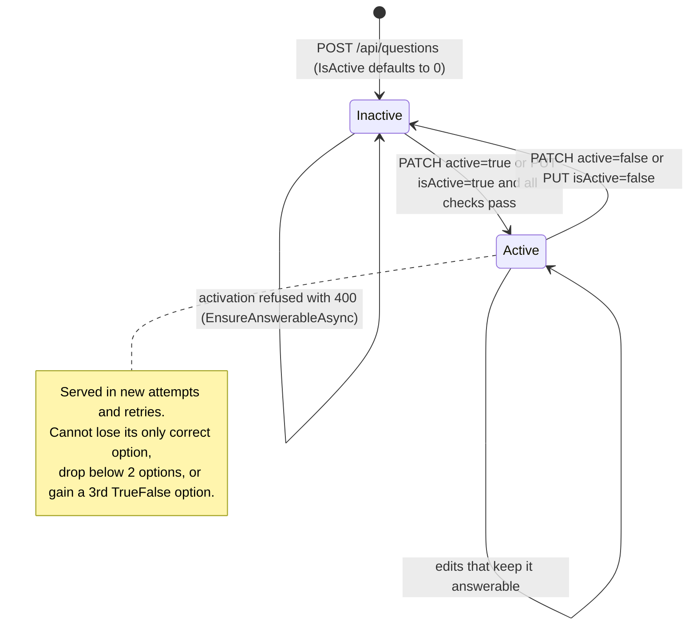

---

### Option authoring (choices, correct answer, images)

- **Purpose:** Lets an admin add, edit and delete the choices of MultipleChoice and TrueFalse questions without breaking a published question or the history of past attempts.
- **Actors:** Admin.
- **Trigger / entry endpoint(s):** `POST /api/question-options`, `PUT /api/question-options/{optionId}`, `DELETE /api/question-options/{optionId}`, `GET /api/question-options?questionId=`.

**Preconditions:** the caller has role `Admin`, and the question exists and is not an Essay.

**Flow — create** (`QuestionOptionService.CreateOptionAsync`)
1. Check that the question exists, or return 404.
2. Normalize the content (`NormalizeContent`):
   - Text and URL are trimmed; blank becomes null.
   - A description sent without an image is dropped.
   - The option needs text or an image.
   - An image always needs a description, even when the option also has text.
   - The description must be at most 1000 characters.
3. Check that the question accepts options (`EnsureQuestionAcceptsOptionsAsync`). An Essay accepts none; a TrueFalse that already has 2 options accepts no more.
4. Check that `DisplayOrder` is free within the question.
5. If `isCorrect` is set, check that no other option of the question is already correct.
6. Insert into `QuestionOptions`. Unique-index races on DisplayOrder or the single correct option become 409. Return 201 with `AdminQuestionOptionResponseDto`; the `Location` points at the by-question listing.

**Flow — update** (`QuestionOptionService.UpdateOptionAsync`)
1. Load the option, or return 404. Normalize the content as above.
2. If `DisplayOrder` changed, check that the new value is free.
3. If the option becomes correct, check that no other option is correct.
4. If the question is active, the option is currently the only correct one, and the request unsets it, refuse.
5. Overwrite the fields and save (same 409 translation). Return 200.

**Flow — delete** (`QuestionOptionService.DeleteOptionAsync`)
1. Load the option, or return 404.
2. Refuse if any `QuizAttemptMistakes` row selected this option.
3. Refuse if any `QuizAttemptQuestions` row froze this option as its answer key.
4. Refuse if the question is active and has 2 or fewer options.
5. Refuse if the question is active and this is its only correct option.
6. Delete. Option translations cascade. Return 204.

**Business rules:**
- Every option needs text or an image (`NormalizeContent`, `CK_QuestionOptions_TextOrImage`). An image needs a non-blank description of at most 1000 characters (`NormalizeContent`, `CK_QuestionOptions_ImageHasDescription`).
- An Essay never has options, and a TrueFalse has at most 2 (`EnsureQuestionAcceptsOptionsAsync`). This is checked on every add, not only at activation.
- There is at most one correct option per question (`EnsureNoOtherCorrectOptionAsync`, `UQ_QuestionOptions_OneCorrectPerQuestion`).
- On an active question the only correct option cannot be unset or deleted (`UpdateOptionAsync`, `DeleteOptionAsync`). As a result, moving the correct answer from option A to option B on an active question takes three steps: deactivate the question, change the options, reactivate. Marking B correct while A is correct is refused, and unsetting A is refused.
- An option used in history cannot be deleted: not if it was chosen as a wrong answer, and not if it is a frozen answer key (`DeleteOptionAsync`, backed by `FK_QuizAttemptQuestions_QuestionId_CorrectOptionId` and `FK_QuizAttemptMistakes_QuestionId_SelectedOptionId`).
- Editing an option's text or image takes effect immediately wherever questions are displayed, including `GET /api/quiz-attempts/{id}` for running attempts. Grading is unaffected, because it uses the frozen key.

**Outcomes & failures:**

| Status | When | Message (from code) |
|---|---|---|
| 201 / 200 / 204 | Success | — |
| 400 | Neither text nor image | `الاختيار يجب أن يحتوي على نص أو صورة على الأقل` |
| 400 | Image without description | `الاختيار الذي يحتوي على صورة يجب أن يحتوي على وصف للصورة حتى يتمكن النظام من تحليل إجابة الطالب` (an option with an image needs a description) |
| 400 | Description longer than 1000 | `وصف الصورة لا يتجاوز 1000 حرف` |
| 400 | Essay question | `السؤال رقم {id} سؤال مقالي ولا يقبل اختيارات` |
| 400 | TrueFalse already has 2 options | `سؤال الصح والخطأ رقم {id} له اختياران بالفعل` |
| 400 / 409 | DisplayOrder taken (pre-check / race) | `الترتيب {n} مستخدم بالفعل في السؤال رقم {questionId}` |
| 400 / 409 | Already has a correct option (pre-check / race) | `السؤال رقم {questionId} له إجابة صحيحة بالفعل` |
| 400 | Unsetting the only correct option of an active question | `لا يمكن إلغاء الإجابة الصحيحة الوحيدة من السؤال رقم {id} وهو مفعّل` |
| 400 | Delete: chosen in past attempts | `لا يمكن حذف الاختيار رقم {id} لأنه مستخدم في محاولات سابقة` |
| 400 | Delete: frozen answer key | `لا يمكن حذف الاختيار رقم {id} لأنه الإجابة الصحيحة المسجّلة في محاولات سابقة` |
| 400 | Delete: active question would drop below 2 options | `لا يمكن حذف الاختيار رقم {id}: السؤال رقم {qid} مفعّل ويحتاج إلى اختيارين على الأقل` |
| 400 | Delete: only correct option of an active question | `لا يمكن حذف الإجابة الصحيحة الوحيدة من السؤال رقم {id} وهو مفعّل` |
| 404 | Question or option not found | `السؤال رقم {id} غير موجود` / `الاختيار رقم {id} غير موجود` |

---

### Lesson quiz preview

- **Purpose:** Shows a child the quiz attached to the lesson they are learning, localized and without the answer key, before they start an attempt.
- **Actors:** Learner (any authenticated role).
- **Trigger / entry endpoint(s):** `GET /api/quizzes/for-lesson/{lessonId}?language=` (`LessonQuizController.GetForLesson` → `QuizService.GetForLessonAsync`).

**Preconditions:** the lesson exists and is published, and it has an active `LessonQuiz` with at least one active question.

**Flow:**
1. Resolve the language.
2. Ask the Content module whether the lesson is published (`ILessonAvailability.IsPublishedAsync`). If it is missing or unpublished, return 404 with the same message in both cases.
3. Select the quiz with the highest `Id` among those with `LessonId = lessonId`, type `LessonQuiz`, `IsActive`, and at least one active question. If none exists, return 404.
4. Localize the title and description (requested → `en` → base).
5. Load the quiz's active questions through the child-safe projection, ordered by `DisplayOrder`, with options in `DisplayOrder`. There is no `isCorrect` and no `imageDescription`; `points` is the live `Questions.Points` and `currentHint` is null.
6. Return 200 `LessonQuizResponseDto` with `quizId`, `lessonId`, `title`, `description`, `totalQuestions`, `language`, `languageFallbackApplied` and `questions`. `languageFallbackApplied` is true if the quiz has no translation in the requested language or any question or option fell back.

**Business rules:**
- A lesson that is missing and a lesson that is unpublished look the same (`QuizService.GetForLessonAsync`).
- Only `LessonQuiz` quizzes are served here; `LessonReview` quizzes are not (`QuizService.GetForLessonAsync`).
- This endpoint is read-only and creates nothing. To answer, the app calls `POST /api/quiz-attempts?quizId={quizId}`, and the questions in that response are the frozen set that gets graded (`LessonQuizResponseDto` remarks).
- The preview does not check that each question has a correct option. A question without one makes the attempt start fail with 400 (see *Quiz attempt start*).

**Outcomes & failures:**
- 200: the preview.
- 404 `الدرس رقم {lessonId} غير موجود` (lesson not found or not published).
- 404 `لا يوجد اختبار متاح للدرس رقم {lessonId}` (no quiz available for the lesson).

---

### First-run placement test

- **Purpose:** Places a new learner at the first level they have not yet mastered. It samples each level's LevelAssessment quiz, easiest level first, and stores the placement exactly once.
- **Actors:** Learner with role `Child`, Content module (level order), SQL Server.
- **Trigger / entry endpoint(s):**
  - `GET /api/placement` (`PlacementService.GetStatusAsync`).
  - `POST /api/placement/start?language=` (`PlacementService.StartAsync` → `QuizAttemptService.StartAsync`).
  - Submission goes through `POST /api/quiz-attempts/{attemptId}/submit` and recovery through `GET /api/quiz-attempts/{attemptId}/result`.

**Preconditions:**
- An active quiz of type `Placement` exists. It owns no questions.
- At least one level has an active `LevelAssessment` quiz with active, non-Essay questions that have a correct option.

**Flow — status** (`PlacementService.GetStatusAsync`)
1. If a `UserPlacements` row exists for the user, return `Completed`. The response carries `attemptId` and `result`, which is recomputed by `PlacementEngine.DescribeAsync` (see below). `placementQuizId` is null.
2. Find the active Placement quiz, taking the highest `Id` (`PlacementEngine.FindActivePlacementQuizIdAsync`). If there is none, return `Unavailable`.
3. If the user has an `InProgress` attempt on that quiz that has not expired (`StartedAt > now − InProgressAttemptTimeout`), return `InProgress` with `placementQuizId` and `attemptId`.
4. If `PlacementEngine.SelectQuestionIdsAsync` returns no questions, return `Unavailable`.
5. If the user has any `Completed` attempt of any quiz, return `Optional`; otherwise return `Required`. Both carry `placementQuizId`.

**Flow — start / resume**
1. `PlacementService.StartAsync` looks up the active Placement quiz, or returns 404.
2. `QuizAttemptService.StartAsync` checks that the quiz is active, then takes the placement branch (`StartPlacementAttemptAsync`):
   1. If `UserPlacements` already has the user, return 409.
   2. If there is a resumable attempt (step 3 of status), return it through `GetByIdAsync`. The questions are rebuilt in serving order and numbered `displayOrder` 1…n.
   3. Otherwise select the question ids (`PlacementEngine.SelectQuestionIdsAsync`):
      - Levels come in `Order` ascending.
      - For each level, take its active LevelAssessment quiz with the highest `Id`.
      - From that quiz, take active questions that are not `Essay` and have at least one `IsCorrect` option, ordered by `DisplayOrder` then `Id`.
      - Keep the first `PlacementQuestionsPerLevel` of them.
   4. If the selection is empty, return 400.
   5. Load the localized rows in the selected order and renumber `displayOrder` 1…n (`NumberInAttemptOrder`).
   6. Freeze the snapshot and insert `QuizAttempts` and `QuizAttemptQuestions`, as in any attempt start.
3. Return **200** (not 201) with `QuizAttemptResponseDto`.

**Flow — submission and placement decision** (inside `QuizAttemptService.GradeAndCommitAsync`)
1. Validation and grading work as for any attempt (see *Quiz attempt submission*). In addition, if the user is already placed, return 409.
2. Before the transaction, `PlacementEngine.EvaluateAsync` runs:
   - It reads the current level order. If there are no levels, return 400.
   - It maps each asked question to the level of its LevelAssessment quiz.
   - It calls `PlacementEngine.Decide` with the frozen Points of the asked questions, the wrong question ids and `EffectivePlacementPassPercentage`.
3. `Decide` works level by level:
   - `totalPoints` = frozen Points of the level's asked questions.
   - `earnedPoints` = Points of those answered correctly.
   - `scorePercentage` = earned ÷ total × 100, rounded to 2 decimals away from zero.
   - The level is `mastered` when at least one question was asked **and** the score ≥ the pass percentage.
   - The learner is placed at the **first level that is not mastered**. If every level is mastered, they are placed at the last level.
   - A warning is logged when the placed level had no placement questions.
4. In the same transaction that completes the attempt, insert `UserPlacements` with `UserId`, `QuizAttemptId`, `PlacedLevelId`, `ScorePercentage` (the attempt's score), `PassPercentage` (stored as a byte) and `PlacedAt = CompletedAt`.
5. The result carries `placement`: `levelId`, `levelTitle`, `levelOrder`, `scorePercentage`, `passPercentage`, `placedAt`, and `levels[]` with only the levels that had questions asked (`levelId`, `levelTitle`, `questionsAsked`, `correctAnswers`, `totalPoints`, `earnedPoints`, `scorePercentage`, `mastered`). `retryQuestions` is `[]` and `hintsStatus` is `NotRequired`.

**Business rules:**
- There is one placement per learner, and one placement per attempt. This is checked before start and before submit, and enforced by `UQ_UserPlacements_UserId` and `UQ_UserPlacements_QuizAttemptId` (`QuizAttemptService.StartPlacementAttemptAsync`, `GradeAndCommitAsync`).
- The placement is committed atomically with the score and statistics (`QuizAttemptService.CommitSubmissionAsync`).
- An open placement attempt is resumed, not duplicated. This holds only for the currently active Placement quiz (`PlacementEngine.FindResumableAttemptIdAsync`).
- The placement test cannot be retried (`QuizAttemptService.StartAsync`) and offers no Hint button (`HintService.RequestHintAsync`). It gets no post-submit hints (`QuizAttemptService.SubmitAsync`).
- Essays are never placement questions (`PlacementEngine.SelectQuestionIdsAsync`). Mastery is weighted by frozen Points, and `correctAnswers`/`questionsAsked` stay counts (`PlacementEngine.Decide`; pinned by `PlacementTests`).
- A level with no placement questions cannot be mastered, so the test never skips a child past a level it could not check (`PlacementEngine.Decide`).
- The pass threshold is inclusive (`PlacementRuleTests.ThePassThresholdIsInclusive` in `Tests/Assessment.Tests/PlacementTests.cs`). With the defaults (4 one-point questions, 75 %), 3 of 4 correct masters a level.
- When the result is described later, the **stored** placed level and pass percentage are used, but the per-level breakdown is recomputed against the **current** level catalog (`PlacementEngine.DescribeAsync`).
- A Completed placement also updates `UserTopicStats`, like any attempt (`UserTopicStatService.UpdateAfterQuizAttemptAsync` has no placement exclusion).
- The status never forces placement on a learner who already completed quizzes before placement existed; they get `Optional` (`PlacementService.GetStatusAsync`).

**Outcomes & failures:**

| Status | When | Message (from code) |
|---|---|---|
| 200 | Status, or start/resume | — |
| 400 | No level has assessable questions (start) | `اختبار تحديد المستوى غير متاح حاليًا: لا توجد أسئلة تقييم مفعّلة للمستويات` (placement unavailable: no active assessment questions) |
| 400 | No levels exist at submit | `لا توجد مستويات متاحة لتحديد مستوى الطالب` |
| 400 | `previousAttemptId` sent for a placement quiz | `اختبار تحديد المستوى لا تتم إعادته` (placement is not retried) |
| 403 | Caller is not `Child` (placement endpoints only) | `ليس لديك صلاحية` |
| 404 | No active Placement quiz (start) | `لا يوجد اختبار تحديد مستوى متاح حاليًا` |
| 409 | Already placed (start or submit) | `تم تحديد مستواك بالفعل، لا يمكن إعادة اختبار تحديد المستوى` (your level is already set) |

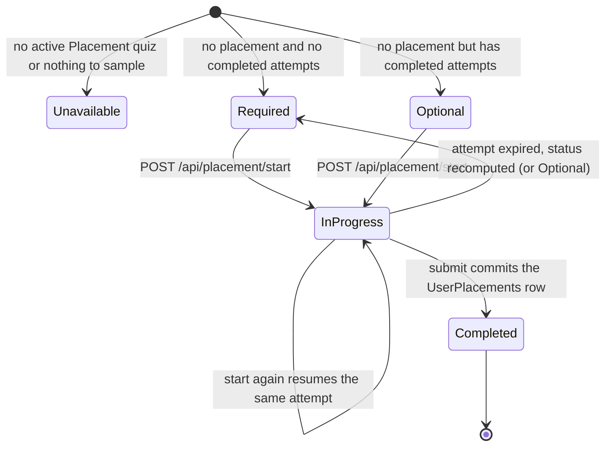

---

### Quiz attempt start and resume (question snapshot)

- **Purpose:** Opens an attempt and freezes, per question, everything grading depends on: classification, type, answer key and Points. Later admin edits can then never re-grade or re-weight the attempt.
- **Actors:** Learner (any authenticated role).
- **Trigger / entry endpoint(s):**
  - `POST /api/quiz-attempts?quizId=&previousAttemptId=&language=` (`QuizAttemptController.Start` → `QuizAttemptService.StartAsync`).
  - Resume: `GET /api/quiz-attempts/{attemptId}?language=` (`QuizAttemptService.GetByIdAsync`).

**Preconditions:** the quiz exists and is active. A quiz bound to a lesson requires that lesson to be published. The quiz must have at least one active question, and every active MultipleChoice or TrueFalse question must have a correct option.

**Flow — start** (first attempt; see *Retry* for `previousAttemptId` and *Placement* for Placement quizzes)
1. Resolve the language, then load the quiz's `IsActive`, `QuizType` and `LessonId`. If the quiz is missing, return 404.
2. If the quiz is inactive, return 400.
3. If `LessonId` is set and `ILessonAvailability.IsPublishedAsync` is not `true`, return 404.
4. For a Placement quiz, take the placement branch. With `previousAttemptId` present, take the retry branch.
5. Load the quiz's active questions through the localized child projection, ordered by `DisplayOrder`. If there are none, return 400.
6. Build the snapshot (`LoadQuestionSnapshotsAsync`). For each question read `TopicId` (null when it has no topic), `Difficulty`, `QuestionType` and `Points`, plus `CorrectOptionId`, the id of the first `IsCorrect` option. If any MultipleChoice or TrueFalse question has no correct option, refuse the whole start with 400 listing the ids. Essays get `CorrectOptionId = null`.
7. Persist in one `SaveChanges` (`PersistAttemptAsync`):
   - One `QuizAttempts` row: `Status = InProgress`, `StartedAt = now`, `TotalQuestionsAtAttempt = n`, counts 0, score 0, `PreviousAttemptId`.
   - One `QuizAttemptQuestions` row per question with the frozen values.
8. Return **201** `QuizAttemptResponseDto`: `attemptId`, `quizId`, `startedAt`, `language`, `languageFallbackApplied`, and `questions[]`. Each question carries `questionId`, `questionText`, `questionType`, `imageUrl`, `difficulty`, `displayOrder`, `points` (the frozen value), `currentHint` and `options[]`. The `Location` header points at `GET /api/quiz-attempts/{attemptId}`.

**Flow — resume / read** (`GetByIdAsync`)
1. Load the attempt filtered by `Id` **and** `UserId`. If it is missing or belongs to someone else, return 404 with the same message in both cases.
2. Read the frozen Points per question.
3. Load the questions:
   - Placement: rebuild the serving order (level `Order`, then `DisplayOrder`, then `Id`, via `PlacementEngine.SortForServingAsync`) and renumber 1…n.
   - Otherwise: the snapshot's questions through the localized projection, ordered by the question's current `DisplayOrder`.
4. Attach the latest hint per question **of this attempt**, in the requested language or, failing that, any language (`GetLatestHintPerQuestionAsync`). Overwrite `points` with the frozen value.
5. Return 200. Text, images and options are the **live** localized content; only `points` comes from the snapshot. The response has no status field. Status is not checked here: Completed and Abandoned attempts are returned too.

**Business rules:**
- Each call to start creates a **new** attempt. Only placement resumes an open attempt (`QuizAttemptService.StartFirstAttemptAsync` versus `StartPlacementAttemptAsync`). Other open attempts simply expire (see *Abandoned-attempt expiry*).
- Any active quiz can be started from this endpoint: `LevelAssessment`, `LessonQuiz`, `LessonReview`, `Standalone`, and also `Placement` (`QuizAttemptService.StartAsync`). The lesson-published gate applies only to lesson-bound quizzes.
- The snapshot is the authority on type, answer key and Points for the attempt's whole life (`LoadQuestionSnapshotsAsync`). `CK_QuizAttemptQuestions_EssayHasNoKey` requires `CorrectOptionId` to be null for Essay and non-null for other types, and `CK_QuizAttemptQuestions_Points` requires Points > 0. The frozen answer key must be an option of that very question and cannot be deleted while referenced (`FK_QuizAttemptQuestions_QuestionId_CorrectOptionId`).
- Ownership is part of every read filter; another user's attempt is indistinguishable from a missing one (`GetByIdAsync`).

**Outcomes & failures:**

| Status | When | Message (from code) |
|---|---|---|
| 201 | Attempt started | — |
| 200 | `GET /api/quiz-attempts/{id}` | — |
| 400 | Quiz inactive | `الاختبار رقم {quizId} غير مفعّل` |
| 400 | No active questions | `الاختبار رقم {quizId} لا يحتوي على أسئلة مفعّلة` |
| 400 | An auto-graded question has no correct option | `لا يمكن بدء المحاولة: الأسئلة أرقام {ids} ليس لها إجابة صحيحة` |
| 404 | Quiz missing | `الاختبار رقم {quizId} غير موجود` |
| 404 | Lesson of the quiz missing or unpublished | `الاختبار رقم {quizId} غير متاح` (quiz not available) |
| 404 | Attempt missing or another user's (GET) | `المحاولة رقم {attemptId} غير موجودة` |

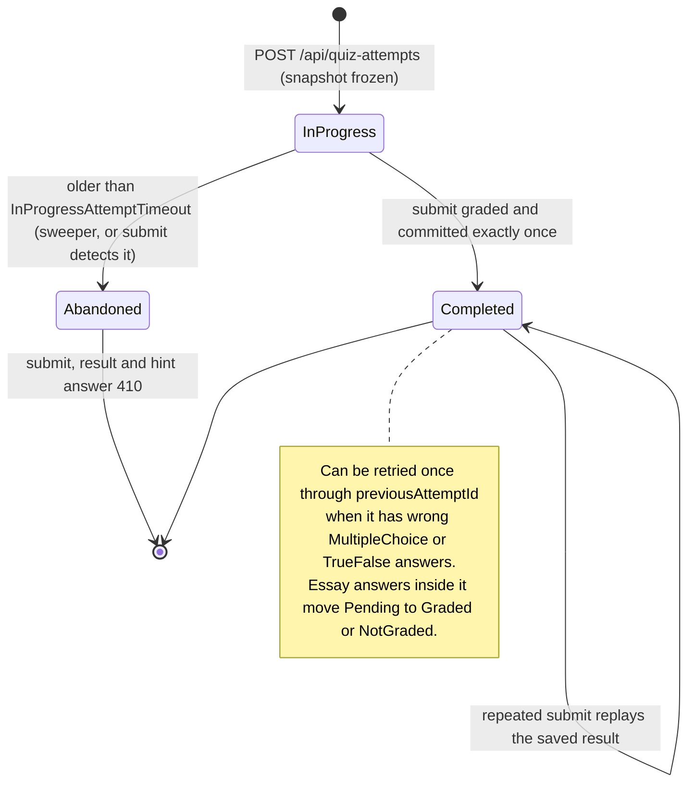

---

### Quiz attempt submission (validation, grading with points, storage, statistics, concurrency)

- **Purpose:** Grades the whole attempt in one call and commits score, wrong answers, essay answers, statistics and (for placement) the placement before any AI work. Then, within a bounded budget, it adds optional AI hints and essay grades.
- **Actors:** Learner, SQL Server, AI provider (optional).
- **Trigger / entry endpoint(s):** `POST /api/quiz-attempts/{attemptId}/submit?language=` with body `{ "mistakes": [{questionId, selectedOptionId}], "essayAnswers": [{questionId, answerText}] }` (`QuizAttemptController.Submit` → `QuizAttemptService.SubmitAsync`).

**Preconditions:** the attempt belongs to the caller, is `InProgress` and has not expired. The body answers **every** question of the attempt: `mistakes` holds the answer to every MultipleChoice and TrueFalse question despite its historical name, and `essayAnswers` holds every essay.

**Flow — Phase A (critical, no AI)** (`GradeAndCommitAsync`)
1. Load the attempt, tracked, by `Id` and `UserId`. If it is missing or someone else's, return 404.
2. Branch on status:
   - `Completed`: skip to replay. Return the saved result via `GetResultAsync` with 200; nothing is re-graded or re-counted and no AI is called.
   - `Abandoned`: return 410.
   - Expired (`StartedAt ≤ now − InProgressAttemptTimeout`): flip the attempt to `Abandoned` with a conditional UPDATE (`MarkAbandonedAsync`), then return 410.
3. For a Placement quiz whose user is already placed, return 409.
4. Read the snapshot for the attempt: `QuestionId`, `CorrectOptionId`, `QuestionType`, `Points`.
5. Validate `mistakes` (`ValidateSubmittedAnswers`): no null item, no duplicate question, and each question must be a MultipleChoice or TrueFalse question of this attempt.
6. Validate `essayAnswers` (`ValidateSubmittedEssays`): no null item, no duplicate, each question must be an Essay of this attempt, the answer must not be blank, and the trimmed length must be ≤ `EffectiveEssayAnswerMaxLength`.
7. Check completeness (`EnsureEveryQuestionAnswered`). Every snapshot question must appear in one of the two lists; otherwise return 400 listing all missing ids in ascending order.
8. Load the selected options. Each must exist and belong to its question; otherwise return 400.
9. Grade against the snapshot key. An answer is wrong when `selectedOptionId ≠ CorrectOptionId`. Then compute:
   - `correctAnswers` = auto-graded count − wrong count.
   - `scorePercentage` = frozen Points of correct MultipleChoice/TrueFalse answers ÷ frozen Points of all MultipleChoice/TrueFalse questions × 100, rounded to 2 decimals away from zero; 0 when nothing is auto-graded (`AttemptScoring.ScorePercentage`).
10. For placement, decide the level now, outside the transaction (see *First-run placement test*).
11. Commit (`CommitSubmissionAsync`, one DB transaction, every call with `CancellationToken.None`):
    1. Insert one `QuizAttemptMistakes` row per **wrong** answer only. Correct answers are not stored.
    2. Insert one `QuizAttemptEssayAnswers` row per essay: trimmed `AnswerText`, `Status = Pending`, `LanguageCode` = the submit language, `MaxPoints` = the frozen Points.
    3. Update the attempt: `QuestionsAnsweredCount = TotalQuestionsAtAttempt`, `CorrectAnswersCount`, `ScorePercentage`, `Status = Completed`, `CompletedAt = now`. The `RowVersion` check makes this transition happen at most once.
    4. For placement, insert `UserPlacements`.
    5. `SaveChanges`.
    6. Update statistics (`UserTopicStatService.UpdateAfterQuizAttemptAsync`, same context and transaction).
    7. Commit.
12. Handle errors while committing:
    - `UQ_UserTopicStats_UserId_TopicId_Difficulty` violated (two attempts of the same child created the same stats row at once): return 409. Nothing was saved, so the child can simply retry.
    - A lost race: `DbUpdateConcurrencyException` (another submit, the sweeper, or a shared stats row changed), a deadlock victim, or a unique violation on `UQ_QuizAttemptMistakes_AttemptId_QuestionId`, `UQ_QuizAttemptEssayAnswers_AttemptId_QuestionId`, `UQ_UserPlacements_UserId` or `UQ_UserPlacements_QuizAttemptId`. The code re-reads the attempt status:
      - `Completed` → replay, 200.
      - `Abandoned` → 410.
      - Placement user clash → 409 already placed.
      - Anything else → 409 concurrent request.
    - Any other database fault → 500 with the generic message.

**Flow — Phase B (optional, after commit)** (`SubmitAsync`)
1. Clear the change tracker, so nothing committed can be re-saved. Start **one** AI budget of `AiHintTimeout`. It is deliberately not tied to the request, so the work finishes even if the app disconnects.
2. For non-placement attempts, build the retry questions with post-submit hints (see *Post-submit hints for retry questions*).
3. If the attempt has essays and budget remains, run inline essay evaluation (`TryEvaluateEssaysAsync` → `EssayEvaluationService.EvaluateAttemptAsync`). Every exception is swallowed and the essays stay `Pending` for the background worker.
4. Read back the saved grading (`LoadSavedGradingAsync`, the same loader `GET …/result` uses) to get essay results and points. If that read fails, fall back to what Phase A committed: `essayResults` is empty, `pendingEssayQuestions` is the number of essays, and the points count every essay as Pending.
5. Return 200 `QuizAttemptResultDto` with these fields:

   | Field | Meaning |
   |---|---|
   | `attemptId`, `quizId`, `completedAt` | Identify the saved result |
   | `totalQuestions` | Every question, essays included |
   | `autoGradedQuestions` | MultipleChoice and TrueFalse questions |
   | `pendingEssayQuestions` | Essays still `Pending` |
   | `essayResults[]` | One entry per essay |
   | `correctAnswers`, `wrongAnswers` | Counts of MultipleChoice/TrueFalse answers |
   | `scorePercentage` | The committed score |
   | `totalPoints` | Frozen Points of all questions, essays included |
   | `earnedPoints` | Correct MultipleChoice/TrueFalse Points plus `awardedPoints` of Graded essays |
   | `pendingPoints` | `maxPoints` of Pending essays |
   | `language`, `languageFallbackApplied` | Language of this response; `languageFallbackApplied` reflects only the `retryQuestions` (false when there are none) |
   | `hintsStatus`, `retryQuestions[]` | Post-submit hints and the questions to retry |
   | `placement` | Only for a placement attempt |

**Business rules:**
- **Every question must be answered.** An omitted answer used to count as correct; now it is a 400 listing the unanswered ids (`QuizAttemptService.EnsureEveryQuestionAnswered`; pinned by `SubmissionCompletenessTests.AnyUnansweredQuestion_IsRejected_ListingThemAll` in `Tests/Assessment.Tests/AiSafetyAndEssayDecisionTests.cs`).
- **Only wrong answers are stored.** A snapshot question with no `QuizAttemptMistakes` row was answered correctly (`CommitSubmissionAsync`, `AttemptScoring`). `FK_QuizAttemptMistakes_QuestionId_SelectedOptionId` guarantees the stored option belongs to its question, and `FK_QuizAttemptMistakes_QuizAttemptQuestions` guarantees the question was part of the attempt.
- **Grading uses the snapshot**, never live `IsCorrect` or `Points`. The option's existence and ownership are still checked against live options (`GradeAndCommitAsync`).
- **Essays never enter `scorePercentage`.** The score is final at submit and is never recomputed (`AttemptScoring.ScorePercentage`; `GetResultAsync` returns the committed column). `earnedPoints` can grow while essays are Pending; it is final once `pendingEssayQuestions` is 0 (`AttemptScoring.CountPoints`).
- A `NotGraded` essay counts in `totalPoints` only: it earns nothing and is no longer pending (`AttemptScoring.CountPoints`).
- `wrongAnswers` is the number of stored mistakes, **not** the persisted computed column `WrongAnswersCount`. That column is answered − correct, and "answered" includes essays (`GetResultAsync`).
- Point totals are `int`, because TINYINT sums would overflow a byte (`AttemptScoring`, `SubmitLifecycleModelTests.ResultDto_PointTotalsAreInt_…` in `Tests/Assessment.Tests/SubmitLifecycleTests.cs`).
- **Idempotent double submit:** a repeated submit of a Completed attempt returns the saved result with 200. It does not re-grade, update statistics a second time, or call the AI again (`SubmitAsync`, `GradeAndCommitAsync`).
- **Commit or nothing:** the transaction runs with `CancellationToken.None`. A dropped connection cannot cut grading off half-way, and the saved result can be recovered with `GET …/result` (`CommitSubmissionAsync`).
- **AI can never fail a submission** or change the committed score. Phase B catches every exception (`BuildRetryQuestionsWithHintsAsync`, `TryEvaluateEssaysAsync`, `TryLoadSavedGradingAsync`).
- **Concurrency protections:**
  - `QuizAttempts.RowVersion` (InProgress → Completed exactly once; the sweeper's update also changes the rowversion).
  - Unique answer rows per attempt and question.
  - `UserPlacements` uniqueness per user and per attempt.
  - `UserTopicStats.RowVersion` plus its unique key.
  - Deadlock-victim detection (`DbUpdateExceptionExtensions.IsDeadlockVictim`).
  - All handled in `GradeAndCommitAsync` and `IsLostSubmissionRace`.

**Outcomes & failures:**

| Status | When | Message (from code) |
|---|---|---|
| 200 | Graded now, or replay of an already-completed attempt | — |
| 400 | Null item in answers / essays | `قائمة الإجابات تحتوي على عنصر فارغ` / `قائمة الإجابات المقالية تحتوي على عنصر فارغ` |
| 400 | Duplicate question | `السؤال رقم {q} مكرر في قائمة الإجابات` / `السؤال رقم {q} مكرر في قائمة الإجابات المقالية` |
| 400 | Answer for a question that is not an auto-graded question of this attempt | `السؤال رقم {q} لا يخص هذه المحاولة أو لا يُصحّح تلقائيًا` |
| 400 | Essay answer for a question that is not an essay of this attempt | `السؤال رقم {q} ليس سؤالًا مقاليًا في هذه المحاولة` |
| 400 | Blank essay / essay too long | `إجابة السؤال رقم {q} فارغة` / `إجابة السؤال رقم {q} تتجاوز {max} حرفًا` |
| 400 | Unanswered questions | `يجب الإجابة على كل أسئلة الاختبار؛ الأسئلة بدون إجابة: {ids}` (every question must be answered; unanswered: …) |
| 400 | Option missing / option of another question | `الاختيار رقم {o} غير موجود` / `الاختيار رقم {o} لا يخص السؤال رقم {q}` |
| 404 | Attempt missing or another user's | `المحاولة رقم {attemptId} غير موجودة` |
| 409 | Concurrent request interfered; nothing saved, retry | `تعذّر تسليم المحاولة رقم {attemptId} بسبب طلب متزامن، برجاء إعادة المحاولة` |
| 409 | Placement: already placed | `تم تحديد مستواك بالفعل، لا يمكن إعادة اختبار تحديد المستوى` |
| 410 | Expired or Abandoned: start a new attempt | `المحاولة رقم {attemptId} انتهت صلاحيتها قبل تسليمها، برجاء بدء محاولة جديدة` |
| 500 | Unexpected fault | `حدث خطأ داخلي في الخادم` |

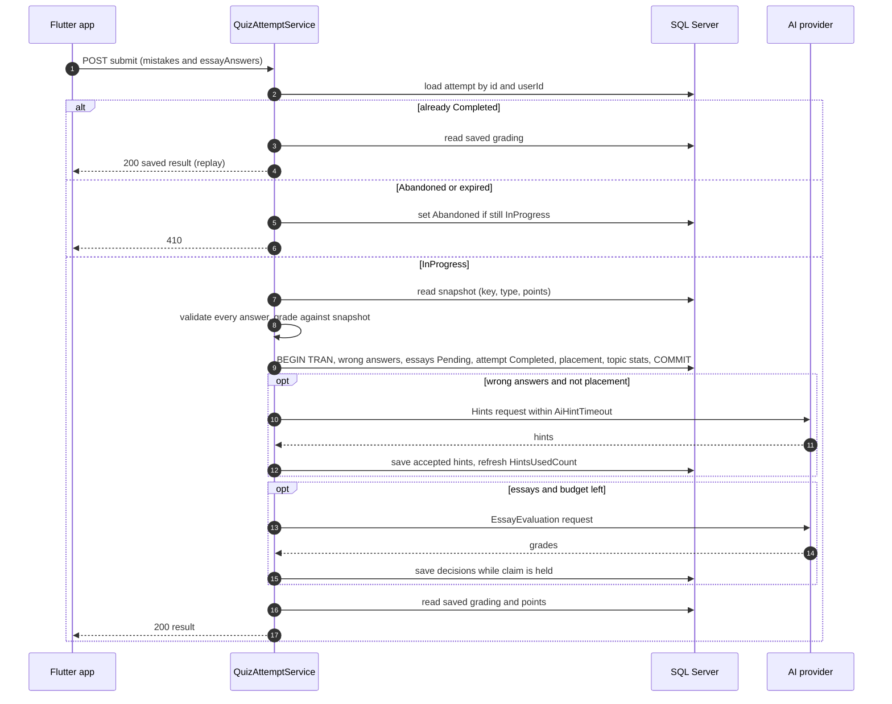

---

### Result recovery

- **Purpose:** Returns the saved result of a submitted attempt, so an app that lost the submit response, or wants later essay grades, can fetch it.
- **Actors:** Learner.
- **Trigger / entry endpoint(s):** `GET /api/quiz-attempts/{attemptId}/result?language=` (`QuizAttemptService.GetResultAsync`). The same method serves the replay of a repeated submit, and `GET /api/quiz-attempts/latest?language=` (`QuizAttemptService.GetLatestResultAsync`), which needs no id.

**Preconditions:** the attempt belongs to the caller and is `Completed`.

**Flow:**
1. Load the attempt by `Id` and `UserId`, together with its quiz type. If it is missing or someone else's, return 404.
2. If it is `Abandoned`, or `InProgress` and past the timeout, return 410. Nothing is written here.
3. If it is `InProgress` and not expired, return 409 (not submitted yet).
4. `LoadSavedGradingAsync` reads three things: the snapshot (type and Points per question), the wrong question ids from `QuizAttemptMistakes`, and the essay results. Essays come from `QuizAttemptEssayAnswers` joined to the snapshot and ordered by the question's `DisplayOrder`; `awardedPoints` and `feedback` are filled only when `Graded`, and `maxPoints` is the frozen Points. Points are computed with `AttemptScoring.CountPoints`.
5. Build the rest by quiz type:
   - Placement: `placement` from `LoadPlacementResultAsync` → `PlacementEngine.DescribeAsync`; `retryQuestions` is empty and `hintsStatus` is `NotRequired`.
   - Otherwise: `retryQuestions` are the wrong questions through the localized projection, each with the latest hint of this attempt, of either kind. `hintsStatus` = `HintStatuses.Resolve(wrongCount, wrong questions that have a hint)`.
6. Return 200 with the committed `scorePercentage`, `correctAnswers` from the attempt row, `wrongAnswers` = number of mistakes, and the current points.

**Flow — latest result** (`GetLatestResultAsync`)
1. Take the caller's attempt (user id from the token) with `Status = Completed`, ordered by `CompletedAt` then `Id`, both descending. InProgress and Abandoned attempts have no result and are skipped, so a newer unfinished attempt does not hide the last result. Placement attempts count. If there is none, return 404.
2. Return `GetResultAsync` for that attempt (steps above). Its status checks always pass, because a Completed attempt never changes status, so the body is identical to `GET /api/quiz-attempts/{attemptId}/result`.

**Business rules:**
- The result always reflects the latest essay grades while the score stays as committed (`GetResultAsync`).
- Submit, replay and GET read through the same loader and so never disagree on points (`LoadSavedGradingAsync`).
- `retryQuestions` here include questions an admin has deactivated since, and show their live Points. `POST /api/quiz-attempts?previousAttemptId=` serves only the still-active ones (`LoadSavedRetryQuestionsAsync` versus `StartRetryAttemptAsync`).
- `hintsStatus` counts any saved hint on a wrong question, Hint-button hints included, in any language (`GetLatestHintPerQuestionAsync`).

**Outcomes & failures:**
- 200: the result.
- 404 `المحاولة رقم {id} غير موجودة`.
- 409 `المحاولة رقم {id} لم يتم تسليمها بعد، برجاء إرسال الإجابات` (not submitted yet, send the answers).
- 410 `المحاولة رقم {id} انتهت صلاحيتها قبل تسليمها، برجاء بدء محاولة جديدة`.
- 404 (latest result only) `لا توجد محاولات مكتملة بعد، أكمل اختبارًا لتظهر نتيجتك هنا` (no completed attempts yet; complete a quiz to see your result here).

---

### Abandoned-attempt expiry and sweeper

- **Purpose:** Closes attempts a child walked away from, so they can no longer be submitted and do not accumulate as InProgress.
- **Actors:** `AbandonedQuizAttemptSweeper` (hosted background service), plus the request paths that apply the same rule on demand.
- **Trigger / entry endpoint(s):** a timer every `AbandonedAttemptSweepInterval` (first run right after startup); on demand in submit, result, Hint button and placement status/start.

**Preconditions:** none. The sweep is safe to run repeatedly and on several instances at once.

**Flow — sweeper** (`AbandonedQuizAttemptSweeper.ExecuteAsync` → `QuizAttemptService.AbandonExpiredAttemptsAsync`)
1. Create a DI scope and compute `cutoff = now − InProgressAttemptTimeout` (`AssessmentSettings.AbandonCutoff`).
2. Repeatedly run a database-side `UPDATE TOP (500) QuizAttempts SET Status = 'Abandoned' WHERE Status = 'InProgress' AND StartedAt <= cutoff` (EF `ExecuteUpdate`) until a batch changes fewer than 500 rows. The filtered index `IX_QuizAttempts_InProgress_StartedAt` serves it.
3. Log how many attempts changed. On exception, log it and wait for the next tick; the host never stops.

**Flow — on-demand rule**
- **Submit** (`GradeAndCommitAsync`): an expired InProgress attempt is flipped to Abandoned with a conditional UPDATE, then 410.
- **Result** (`GetResultAsync`) and **Hint button** (`HintService.RequestHintAsync`): an expired InProgress attempt is treated as Abandoned (410) without writing.
- **Placement** (`PlacementEngine.FindResumableAttemptIdAsync`): an expired attempt is not resumable, so a new one is started.
- `GET /api/quiz-attempts/{id}` does not check expiry.

**Business rules:**
- The rule is `Status = InProgress AND StartedAt <= now − InProgressAttemptTimeout`, defined once (`AssessmentSettings.AbandonCutoff`). The timeout is clamped to at least 30 minutes, so a misconfiguration can never abandon live attempts (`AssessmentSettings.InProgressAttemptTimeout`).
- Completed attempts are never touched; the WHERE clause only matches InProgress (`AbandonExpiredAttemptsAsync`).
- A sweep racing a submit is safe. The sweep's UPDATE changes the attempt's rowversion, so the submit's save fails with a concurrency conflict; it re-reads the status and answers 410 (`GradeAndCommitAsync`).
- An Abandoned attempt is final: it cannot be submitted, retried (retry requires Completed) or hinted.

**Outcomes & failures:** no user-facing response from the sweeper itself. Children see 410 on submit, result or hint for such attempts.

---

### Retry of wrong answers

- **Purpose:** Lets a child re-answer only the MultipleChoice and TrueFalse questions they got wrong in a completed attempt, with the latest hint for each.
- **Actors:** Learner.
- **Trigger / entry endpoint(s):** `POST /api/quiz-attempts?quizId={quizId}&previousAttemptId={attemptId}&language=` (`QuizAttemptService.StartAsync` → `StartRetryAttemptAsync`).

**Preconditions:**
- The quiz is still active and, if lesson-bound, its lesson is still published.
- The previous attempt is the caller's own, belongs to this quiz, is `Completed`, has not been retried yet, and has at least one wrong answer whose question is still active.

**Flow:**
1. The common start checks run first: quiz exists and is active, lesson published, not a Placement quiz.
2. Load the previous attempt filtered by `Id` and `UserId`. If it is missing or someone else's, return 404.
3. If its `QuizId` differs from `quizId`, return 400. If its status is not `Completed`, return 400.
4. If any attempt already has `PreviousAttemptId = previousAttemptId`, return 400.
5. Read the wrong question ids from `QuizAttemptMistakes`. If there are none, return 400. Essays can never be here, because only MultipleChoice and TrueFalse answers produce mistakes.
6. Keep only the questions that are still active. If none remain, return 400.
7. Attach `currentHint` = the latest hint per question of the **previous** attempt, requested language first, else any language (`GetLatestHintPerQuestionAsync`). This covers post-submit and Hint-button hints alike.
8. Take a fresh snapshot from the live questions (current key and Points) and persist a new `QuizAttempts` row with `PreviousAttemptId` set, plus its `QuizAttemptQuestions`.
9. If `UQ_QuizAttempts_PreviousAttemptId` is violated (a concurrent retry won), return 409. Otherwise return 201 with the questions.

**Business rules:**
- An attempt can be retried at most once (`StartRetryAttemptAsync` pre-check; filtered unique index `UQ_QuizAttempts_PreviousAttemptId`, pinned by `SubmitLifecycleModelTests.RetryUniqueness_IsFiltered_…`). A retry is itself an attempt and can in turn be retried once when it has wrong answers.
- A retry contains only the previously wrong, still-active questions (`StartRetryAttemptAsync`). It is graded, scored and counted in statistics like any attempt, over those questions only.
- Placement attempts are never retried (`StartAsync`).
- The retry's snapshot is taken at retry time, so an admin fix to the key or Points between attempts applies to the retry (`LoadQuestionSnapshotsAsync`).
- `GET /api/quiz-attempts/{retryAttemptId}` shows only hints saved on the retry attempt itself; the hints carried over from the previous attempt are not shown there (`GetByIdAsync`).

**Outcomes & failures:**

| Status | When | Message (from code) |
|---|---|---|
| 201 | Retry attempt started | — |
| 400 | Previous attempt belongs to another quiz | `المحاولة رقم {prev} لا تخص الاختبار رقم {quizId}` |
| 400 | Previous attempt not completed | `لا يمكن إعادة المحاولة رقم {prev} لأنها لم تكتمل` |
| 400 | Already retried | `تمت إعادة المحاولة رقم {prev} من قبل` |
| 400 | No wrong answers | `المحاولة رقم {prev} لا تحتوي على إجابات خاطئة لإعادتها` |
| 400 | Wrong questions no longer available | `أسئلة المحاولة رقم {prev} الخاطئة لم تعد متاحة لإعادتها` |
| 400 | Placement quiz | `اختبار تحديد المستوى لا تتم إعادته` |
| 404 | Previous attempt missing or another user's | `المحاولة رقم {prev} غير موجودة` |
| 409 | Concurrent retry won the race | `تمت إعادة المحاولة رقم {prev} بالفعل` |
| 400 / 404 | Common start checks and snapshot: quiz inactive, quiz missing, lesson missing or unpublished, a remaining question without a correct option | Same messages as *Quiz attempt start* |

---

### Hint button (escalating hints during an attempt)

- **Purpose:** Gives a child, on request, up to `MaxHintLevels` progressively more direct hints for one question of a running attempt, none of which may reveal the correct answer.
- **Actors:** Learner, AI provider (`Ai:HintsEndpoint`, task `Hint`).
- **Trigger / entry endpoint(s):** `POST /api/quiz-attempts/{attemptId}/questions/{questionId}/hint?language=` (`HintService.RequestHintAsync`).

**Preconditions:** the attempt is the caller's own, `InProgress`, not expired and not a placement attempt. The question is part of the attempt's snapshot, and the question has fewer than `MaxHintLevels` Hint-button hints in this attempt.

**Flow:**
1. Load the attempt by `Id` and `UserId`, or return 404.
2. If it is Abandoned or expired, return 410. If it is not InProgress (Completed), return 409. If it is a placement attempt, return 409.
3. Load the snapshot row for the question. If the question is not in the attempt, return 404.
4. Count this attempt and question's hints with `AttemptNumber` set, across **all languages**. If `count ≥ EffectiveMaxHintLevels`, return 409. Otherwise `attemptNumber = count + 1`.
5. If the hints endpoint is not configured, return 200 with `hint: null` and `hintsStatus: "Unavailable"`.
6. Load the live localized question and options. Return `Unavailable` (200, no hint) in any of these cases:
   - an auto-graded question whose frozen correct option is no longer among its options;
   - a correct option with neither text nor image description;
   - a question with neither text nor image description.
7. Call the AI (`TryGenerateAsync`) within a budget linked to the request and capped by `AiHintTimeout`. The request (`HintRequest`) carries `contractVersion "2"`, `task "Hint"`, `attemptNumber`, `language`, `learnerContext.age` (only when known), and the question: text, type, image (description, and bytes if enabled), options, and `correctAnswer {optionId, text}` (null for Essay). It also carries `previousHints`: earlier hints of this attempt, question and language, oldest first.
8. Reject the answer and return 200 with `hint: null` and `hintsStatus: "Partial"`, saving nothing and using no level, if any of these happen:
   - the AI call fails for any reason (error, timeout, cancellation);
   - `status` is present and not `Ok`;
   - the hint is blank or longer than `EffectiveMaxHintLength`;
   - for non-Essay questions, `HintSafety.RevealsAnswer` finds the correct option's text or description named. For TrueFalse, only an explicit verdict counts;
   - for non-TrueFalse questions, `HintSafety.IsTooSimilar` scores ≥ `EffectiveHintSimilarityThreshold`.
9. Save the `QuestionHints` row: `QuizAttemptMistakeId = null`, `AttemptNumber`, `HintSequence` = last sequence for (attempt, question, language) + 1, `LanguageCode`. Two unique indexes guard the save (`SaveAsync`):
   - `UQ_QuestionHints_AttemptId_QuestionId_AttemptNumber`, filtered on `AttemptNumber IS NOT NULL`: one Hint-button hint per level per attempt and question, **in any language** (migration 002);
   - `UQ_QuestionHints_AttemptId_QuestionId_Language_Sequence`: one hint per sequence number per attempt, question and language.

   If either is violated, two presses computed the same level at the same moment and the other one is already saved. Clear the change tracker and return 409; this press saved nothing and used no level.
10. Return 200 `{ questionId, attemptNumber, hint, hintsStatus: "Generated", hintsRemaining, language }` with `hintsRemaining = max(MaxHintLevels − attemptNumber, 0)`. The 200 answers of steps 5, 6 and 8 carry `hintsRemaining = max(MaxHintLevels − (attemptNumber − 1), 0)`, the same as before the press (`HintService.HintsRemaining`).

**Business rules:**
- The level is derived server-side from saved hints and cannot be chosen by the client. It is counted across languages, so switching language does not grant new levels (`HintService.RequestHintAsync`).
- Every level faces the same leak checks; level 2 is more direct, never looser (`HintService.TryGenerateAsync`, `HintSafety`).
- A press that produces no accepted hint (`Partial` or `Unavailable`) does not consume a level and is not counted against the child: nothing is saved, `hintsRemaining` is unchanged, the next press asks for the same level, and topic statistics never see it (`RequestHintAsync`, `HintService.HintsRemaining`).
- Each level is saved at most once per attempt and question, whatever the language (`UQ_QuestionHints_AttemptId_QuestionId_AttemptNumber`, `HintService.SaveAsync`). Two concurrent presses, in one language or in two, can no longer both use a level; one gets 409. Migration 002 renumbered levels that earlier races had duplicated (by `GeneratedAt`, then `Id`) before creating the index.
- Hints never touch scoring (`HintService`; the submit pipeline is independent). Saved hints count in `UserTopicStats.HintsUsedCount` at the next submit (`UserTopicStatService.CountHintsByBucketAsync`), which the progress map shows as `hintsUsed`.
- Essay questions can be hinted, with no answer to leak (`TryGenerateAsync`).
- No placement hints (`RequestHintAsync`). The AI never receives a user, attempt or account id, or an image URL (`HintRequest`, `AiRequestBuilder.BuildImageAsync`).

**Outcomes & failures:**

| Status | When | Message / body |
|---|---|---|
| 200 | `hintsStatus` = `Generated` (hint present, level used), `Partial` (AI failed or timed out, or the hint was unusable or unsafe; no level used), `Unavailable` (AI not configured, or the question cannot be described to it; no level used) | `HintResponseDto` with `hintsRemaining` |
| 404 | Attempt missing or another user's | `المحاولة رقم {id} غير موجودة` |
| 404 | Question not in attempt | `السؤال رقم {q} ليس ضمن المحاولة رقم {id}` |
| 409 | Attempt already submitted | `المحاولة رقم {id} تم تسليمها، ولا يمكن طلب تلميح بعد التسليم` (submitted, no hints after submit) |
| 409 | Placement attempt | `اختبار تحديد المستوى لا يحتوي على تلميحات` |
| 409 | Levels exhausted | `لا توجد تلميحات إضافية للسؤال رقم {q} في هذه المحاولة` (no more hints for this question) |
| 409 | Two presses for the same question at once, in any language (either unique index); this press saved nothing and used no level | `تم طلب تلميح لنفس السؤال بالفعل، برجاء المحاولة مرة أخرى` (a hint was already requested for this question, please try again) |
| 410 | Expired | `المحاولة رقم {id} انتهت صلاحيتها قبل تسليمها، برجاء بدء محاولة جديدة` |

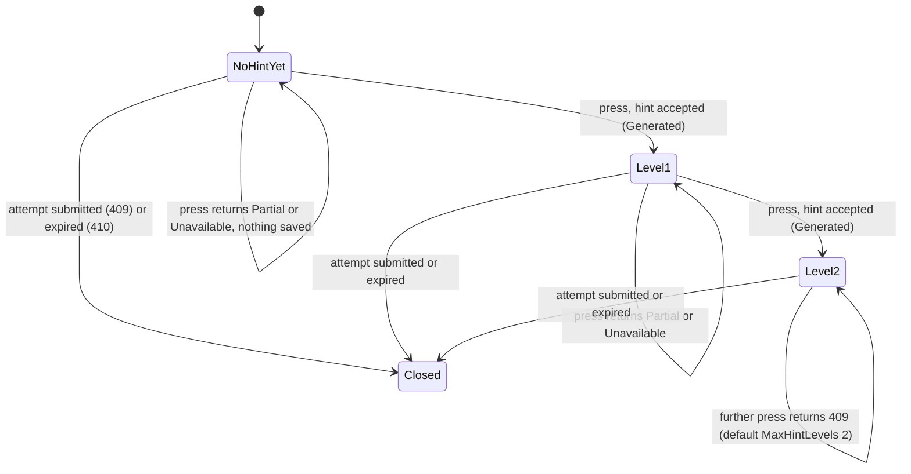

---

### Post-submit hints for retry questions

- **Purpose:** Right after a submission commits, asks the AI for one hint per wrong MultipleChoice or TrueFalse answer, so the result's `retryQuestions` can show them and a later retry starts with them.
- **Actors:** Submission (Phase B), AI provider (`Ai:HintsEndpoint`, task `Hints`).
- **Trigger / entry endpoint(s):** inside `POST /api/quiz-attempts/{attemptId}/submit` (`QuizAttemptService.BuildRetryQuestionsWithHintsAsync`). Hints are read back by `GET …/result` and by the retry start.

**Preconditions:** the submission committed, the attempt is not a placement, and it has at least one wrong answer.

**Flow:**
1. With no wrong answers, return `retryQuestions: []` and `hintsStatus: "NotRequired"`.
2. Load the wrong questions through the localized projection. If this fails, return `retryQuestions: []` with `hintsStatus: "Unavailable"` (the result endpoint can recover them later).
3. If the hints endpoint is not configured, skip the AI.
4. Otherwise build the request (`GenerateHintsAsync`) within the submission's AI budget:
   - Read the frozen key, type and difficulty per wrong question, the localized topic names (none for a question with no topic, which is sent as `topic: null`), the learner's age, and previous hints for those questions across all of this user's attempts in the same language.
   - Skip (log only) any question whose question text and description are both missing, or whose selected or correct option has neither text nor description.
   - Send `contractVersion "2"`, `task "Hints"`, `language`, `learnerContext`, and `items[]`. Each item has `questionId`, `questionType`, `difficulty`, `topic`, `question {text, image}`, `options[] {optionId, text, image}` (never an isCorrect flag), `studentAnswer.selectedOptionId`, `reference.correctOptionId` and `previousHints`.
5. Accept only results that meet all of these:
   - for a question that was asked, and exactly one per question;
   - `status` missing or `Ok`;
   - non-blank and ≤ `EffectiveMaxHintLength`;
   - not revealing the correct option (`HintSafety.RevealsAnswer`), and for non-TrueFalse not too similar to it (`HintSafety.IsTooSimilar`).

   An AI exception or timeout leaves no hints.
6. Persist accepted hints (`PersistHintsAsync`): one `QuestionHints` row per hinted mistake, with `QuizAttemptMistakeId` set, `AttemptNumber = null`, and `HintSequence` continuing after any Hint-button hints in the same language. Then recompute `HintsUsedCount` for the attempt's buckets (`UserTopicStatService.RefreshHintsUsedCountAsync`). A save failure is logged and the generated hints are still returned. A concurrency conflict on the refresh is logged; the count self-heals at the next submission.
7. Return `retryQuestions`: every wrong question in `DisplayOrder` with `currentHint` or null. Their `points` are the live `Questions.Points`, not the frozen value. `hintsStatus` = `HintStatuses.Resolve(wrongCount, hintedCount)`, which gives `Generated` (all hinted), `Partial` (some), or `Unavailable` (none).

**Business rules:**
- Hints are optional. The score in the same response is final whatever `hintsStatus` says (`HintStatuses`, `SubmitAsync`).
- One AI budget (`AiHintTimeout`) covers hints first, then inline essays; hints run first because they feed the retry (`SubmitAsync`).
- Previous hints sent as context are same-language only, so an Arabic hint is not context for an English one (`GenerateHintsAsync`).
- A question skipped for hints still appears in `retryQuestions` without a hint (`BuildRetryQuestions`).
- The request carries no user, attempt or account identifier, and never an image URL (`GenerateHintsRequest`, `AiRequestBuilder.BuildImageAsync`).

**Outcomes & failures:** the submission always returns 200. Hint problems only show up as `hintsStatus` `Partial` or `Unavailable` and `currentHint: null`.

---

### AI essay grading lifecycle

- **Purpose:** Grades essay answers with the AI only — no teacher, no model answer, no rubric. A well-formed AI grade becomes final points and feedback; otherwise the essay ends `NotGraded`.
- **Actors:** Submission (inline), `EssayEvaluationWorker` (background), `EssayEvaluationService`, AI provider (`Ai:EssayEvaluationEndpoint`), SQL Server.
- **Trigger / entry endpoint(s):**
  - Inline, after commit in `POST /api/quiz-attempts/{attemptId}/submit` (`EssayEvaluationService.EvaluateAttemptAsync`).
  - Background, every `EssayEvaluationInterval` (`EssayEvaluationWorker` → `EssayEvaluationService.EvaluateDueAsync`).
  - The child reads grades through the submit response or `GET /api/quiz-attempts/{attemptId}/result`.

**Preconditions:** an essay answer was committed with `Status = Pending`, `AiOutcome = null`, `AiEvaluationAttempts = 0` and `MaxPoints` = the frozen Points. `Ai:EssayEvaluationEndpoint` is configured; if it is empty, nothing is attempted or counted and essays remain Pending.

**Flow — inline** (`EvaluateAttemptAsync`)
1. If the endpoint is not configured, or the submission's AI budget is already spent, do nothing.
2. Select this attempt's essays that are `Pending` with no outcome, then **claim and evaluate** them (below). The remaining submission budget bounds both starting and finishing the request.

**Flow — background** (`EvaluateDueAsync`, one batch per tick; first tick at startup)
1. If the endpoint is not configured, return 0.
2. **Close stale answers.** Pending answers with no outcome, `AiEvaluationAttempts ≥ max`, and a last attempt older than `EssayClaimLifetime` (or never) become `NotGraded` with outcome `Failed`, in one UPDATE.
3. **Pick due answers**, up to 20 ordered by `Id`, that meet all of these:
   - `Pending` with no outcome;
   - attempts < max;
   - `CreatedAt ≤ now − EssayInlineGrace`, so the submission gets the first try;
   - due: never tried, or `AiLastAttemptAt + RetryMinutes × attempts ≤ now`. The wait grows: 10, 20, 30… minutes by default.
4. Claim and evaluate with a **batch deadline** of `EssayEvaluationTimeout`. The deadline only stops new requests from starting; host shutdown aborts a request in flight.

**Claim and evaluate** (`ClaimAndEvaluateAsync`, `EvaluateAttemptEssaysAsync`)
1. **Claim** in one atomic UPDATE: rows still matching the due conditions get `AiClaimId = new Guid`, `AiLastAttemptAt = now` and `AiEvaluationAttempts + 1`. If nothing was claimed, stop. Rows another run just claimed no longer match.
2. Load the rows carrying this claim and group them **per attempt**: one request per attempt, meaning one child, in that child's `LanguageCode`.
3. For each attempt group, with a per-request deadline of `EssayEvaluationTimeout`:
   1. Load the localized question and topic. If a question has neither text nor image description, close it immediately as `NotGraded` / `Failed`; retrying cannot help.
   2. Send `EssayEvaluationRequest`: `contractVersion "2"`, `requestId`, `task "EssayEvaluation"`, `language`, and `items[]`. Each item has `itemId` (an opaque "1", "2"…, never a DB id), `difficulty`, `topic`, `question {text, image {description, content?}}`, `maxPoints` and `studentAnswer.text`.
   3. Interpret the response `results[] {itemId, status, points, feedback, confidence?, reason?}`. A result whose `itemId` appears more than once is discarded entirely, so that essay has no result. Each essay gets a decision from `EssayEvaluationService.Decide`:
      - No result, or an unknown status → **Unusable**.
      - `Skipped` → **Declined**.
      - `Ok` or missing status, with integer `points` in 0…`MaxPoints`, feedback non-blank after trimming and ≤ `EffectiveMaxEssayFeedbackLength`, and `confidence` absent or in 0…1 → **Accept**.
      - Anything else → **Unusable**.

      A request that throws or hits its own deadline makes every item Unusable, and the attempt counts.
   4. Apply the decision (`EssayEvaluationService.Apply`):
      - **Accept** → `Status = Graded`, `AwardedPoints`, `Feedback`, `GradedBy = "Ai"`, `GradedAt`, `AiOutcome = Accepted`, `AiConfidence` rounded to 2 decimals (monitoring only).
      - **Declined** → `NotGraded`, `AiOutcome = Declined`, no points, feedback or grader. The `reason` is logged (truncated to 200 chars), never stored or shown.
      - **Unusable** → stays `Pending` for a later run, unless this was the last allowed attempt, which makes it `NotGraded` / `Failed`.
   5. Save each non-Pending decision with a conditional UPDATE that succeeds only while the row still carries **this claim** and is still Pending with no outcome. Otherwise the decision is discarded, so a final status is never overwritten.
4. If the caller's budget runs out before or during a request (submission budget, batch deadline, shutdown), **release** the unfinished rows: `AiClaimId = null`, attempts − 1. That attempt is not counted, and `AiLastAttemptAt` is kept. A database fault releases that attempt group and the run continues with the next group.

**What the child sees** (`QuizAttemptService.LoadEssayResultsAsync`, `EssayResultDto`)
- `essayResults[]` holds one entry per essay: `questionId`, `status` (`Pending | Graded | NotGraded`), `maxPoints`, and `awardedPoints` and `feedback` **only when Graded**.
- `pendingEssayQuestions` and `pendingPoints` count Pending essays. `earnedPoints` includes awarded points of Graded essays. `scorePercentage` never changes.
- `Declined` and `Failed` both show as `NotGraded`. The DTO has no grader, outcome, confidence or reason.

**Business rules:**
- Essays are graded by the AI only. `GradedBy` can only be `Ai` (`EssayEvaluationService.Apply`; `CK_QuizAttemptEssayAnswers_GradedBy`).
- There is no confidence gate: a well-formed `Ok` result is the grade (`EssayEvaluationService.Decide`; pinned by `EssayDecisionTests.ALowConfidence_NeverBlocksTheGrade` in `Tests/Assessment.Tests/AiSafetyAndEssayDecisionTests.cs`).
- `Graded` and `NotGraded` are final. `AiOutcome` is null exactly while Pending (`CK_QuizAttemptEssayAnswers_OutcomeMatchesStatus`). A grade can never exceed `MaxPoints` (`Decide`, `CK_QuizAttemptEssayAnswers_AwardedWithinMax`).
- **Claims:**
  - Two app instances never evaluate the same answer at once (atomic claim UPDATE in `ClaimAndEvaluateAsync`).
  - A decision is written only while its claim is held (`SaveDecisionAsync`).
  - A claim older than `EssayClaimLifetime` belongs to a dead run. The lifetime is `max(AiHintTimeout, 2 × EssayEvaluationTimeout) + 1 minute`, 2 minutes with defaults (`AssessmentSettings.EssayClaimLifetime`; pinned by `AiSettingsDefaultsTests.AClaim_…`).
- **Attempts:** each claim counts one attempt, up to `EffectiveEssayEvaluationMaxAttempts`, default 5 and clamped 1…20. An AI that is simply too slow uses up an attempt; running out of the caller's time does not (`EvaluateAttemptEssaysAsync`, `ReleaseAsync`).
- One request never mixes children's answers (`ClaimAndEvaluateAsync` groups by attempt). Feedback is requested in the language the child answered in (`QuizAttemptEssayAnswers.LanguageCode`).
- Essays are never counted in `UserTopicStats`, even after grading (`UserTopicStatService.UpdateAfterQuizAttemptAsync`). A Graded essay's `AwardedPoints` do count as XP on the progress map (`UserTopicStatService.LoadXpAsync`).

**Outcomes & failures:** no endpoint errors belong to this process. AI failures only delay or close grading. With the essay endpoint unconfigured, essays stay `Pending` indefinitely and `pendingPoints` never resolves.

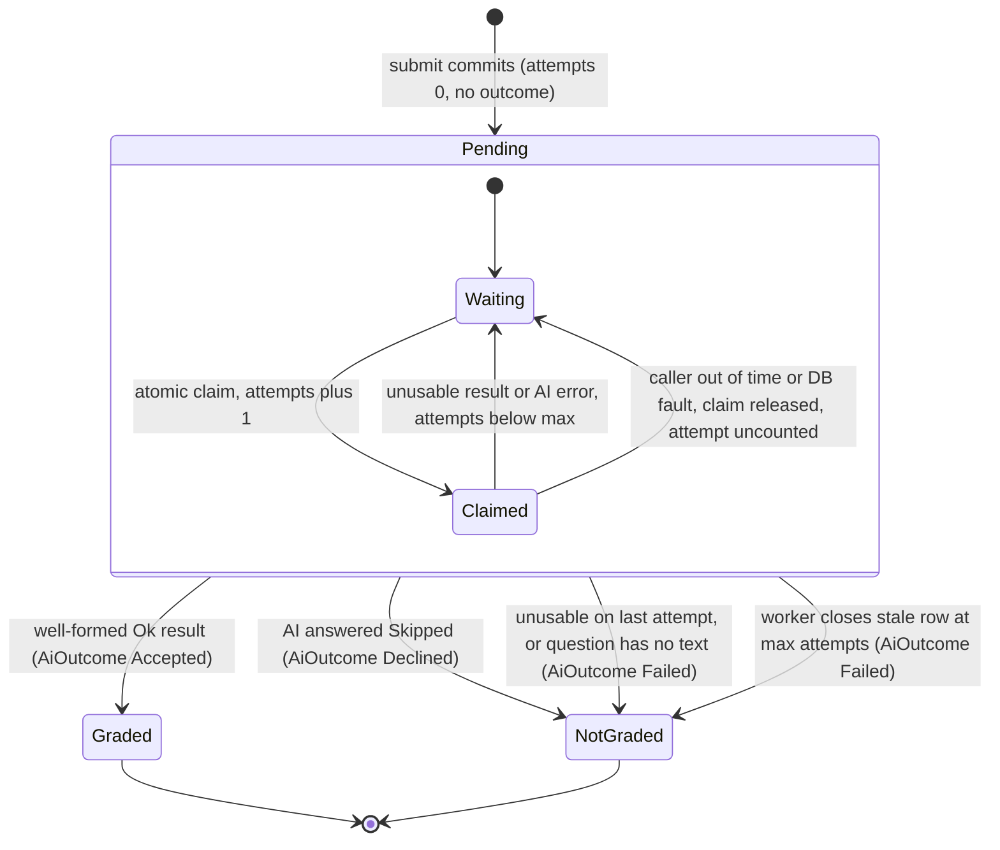

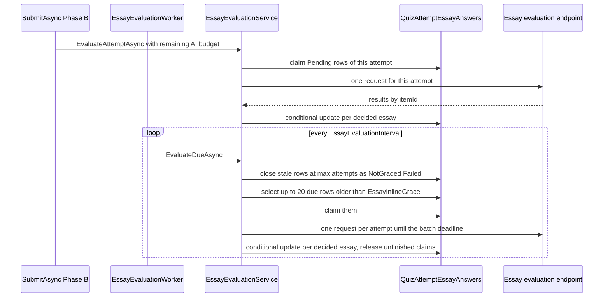

---

### User topic statistics

- **Purpose:** Keeps, per learner and per (topic, difficulty), how many auto-graded questions were answered, how many correctly, and how many hints were used. On read, it combines them with the XP earned in attempts into the child's progress map: XP, mastery, stars and an encouraging message for every topic.
- **Actors:** Submission transaction, post-submit hints, Learner (reads).
- **Trigger / entry endpoint(s):**
  - Written inside `POST /api/quiz-attempts/{attemptId}/submit` (`UserTopicStatService.UpdateAfterQuizAttemptAsync`, `RefreshHintsUsedCountAsync`).
  - Read via `GET /api/user-topic-stats?language=` (`GetMyProgressAsync`) and `GET /api/user-topic-stats/{topicId}?language=` (`GetTopicProgressAsync`).

**Preconditions:** for writes, the attempt is the user's own and `Completed` within the same transaction. For reads, any authenticated user; the user id comes from the token.

**Flow — update at submit** (`UpdateAfterQuizAttemptAsync`)
1. Load the attempt by `Id` and `UserId` (404 if absent). If it is not `Completed`, throw a 400 business rule; this cannot happen on the normal path.
2. Read the attempt's **non-Essay** snapshot rows **that have a topic** (`QuestionId`, frozen `TopicId`, frozen `Difficulty`). A question with no topic has no bucket to count in and is skipped. If no rows remain, stop.
3. Read the attempt's wrong question ids once.
4. Count hints: all of this user's `QuestionHints`, of any attempt, kind or language, grouped by the frozen topic and difficulty of the hinted attempt-question, limited to the topics involved. Hints on questions with no topic are never counted. Hint-button hints on Essay questions are included, although essays are not counted as answered (`CountHintsByBucketAsync`).
5. Group the questions into buckets (`TopicId`, `Difficulty`). For each bucket: `Answered` = number of questions, `Correct` = number not wrong, `Hints` = hint count for that bucket.
6. Read existing `UserTopicStats` rows for the user and topics, tracked. For each bucket, create the row if missing, then:
   - `QuestionsAnsweredCount += Answered`
   - `CorrectCount += Correct`
   - `HintsUsedCount = Hints` (recomputed, not accumulated)
   - `LastQuizAttemptId`, `LastPracticedAt = CompletedAt`, `UpdatedAt = CompletedAt`

   `WrongCount` is a computed column.
7. `SaveChanges`, protected by `RowVersion` and `UQ_UserTopicStats_UserId_TopicId_Difficulty`. A conflict aborts the whole submission with 409 (see *Submission*).

**Flow — hints refresh.** After post-submit hints are saved, `RefreshHintsUsedCountAsync` recomputes `HintsUsedCount` for the buckets this attempt touched (its non-Essay questions that have a topic). It is idempotent.

**Flow — read the progress map** (`GetMyProgressAsync`)
1. Resolve the language: `?language=` → `Accept-Language` → `ar`.
2. Load the user's `UserTopicStats` rows: answered, correct, hints and last practised, per topic and difficulty.
3. Load XP per (topic, difficulty) from the attempt history (`LoadXpAsync`), with a null topic for questions that have none:
   - Every non-Essay snapshot row of the user's `Completed` attempts with no `QuizAttemptMistakes` row (a correct answer) earns its frozen `Points`.
   - Every `Graded` essay answer earns its `AwardedPoints`, attributed to its snapshot topic and difficulty. `Pending` and `NotGraded` essays earn nothing.
4. Load the topics to list: every active topic of an active category, plus every topic the user has stats rows or XP in, even an inactive one or one in an inactive category. The topic's name and description, and its category's name, resolve requested language → `en` → base column.
5. Build each topic (`BuildTopic`):
   - Keep, in the order `Easy`, `Medium`, `Hard`, `Advanced`, the difficulties that have a stats row or XP.
   - Sum answered, correct, hints and XP over them.
   - Compute mastery, stars, accuracy and message (`TopicProgress`, below).
   - `LastPracticedAt` is the latest of the stats rows, or null without one.
6. Order the topics by category `SortOrder`, then `CategoryId`, then learning level (`Beginner`, `Intermediate`, `Advanced`), then `Id`. Group them into categories, each with its summed XP and topic counts.
7. Compute the totals:
   - `questionsAnswered`, `correctAnswers` and `hintsUsed` are sums over the listed topics, and `accuracyPercentage` comes from those sums.
   - `topicsStarted` counts topics that are not `NotStarted`; `topicsMastered` counts `Mastered` ones.
   - `totalXp` is **every** XP row, including questions with no topic, so it can be more than the sum of the topics' XP.
   - The headline comes from `TopicProgress.Headline`.
8. Return 200 `MyProgressResponseDto`. There is no 404: a child with no progress gets every listed topic as `NotStarted`.

**Flow — read one topic** (`GetTopicProgressAsync`)
1. Load the topic by id, active or not, with localized names. If it does not exist, return 404.
2. Load that topic's stats rows and XP, build it as in step 5 above, and return 200 `TopicProgressDto`. A topic without progress is `NotStarted`.

**Progress rules** (`TopicProgress`, pinned by `TopicProgressTests` in `Tests/Assessment.Tests/TopicProgressTests.cs`)
- **Accuracy:** correct ÷ answered × 100, rounded half away from zero to a whole number; 0 before any answer.
- **Mastery**, checked in this order:
  1. No answer counted: `Learning` if the topic has XP or a hint, otherwise `NotStarted`.
  2. `correct × 100 < 50 × answered`: `Learning`.
  3. `correct × 100 ≥ TopicMasteryPercentage × answered` and `answered ≥ TopicMasteryMinQuestions`: `Mastered` (defaults 80 and 5).
  4. Otherwise: `Practicing`.

  The comparison is exact, not on the rounded accuracy: 79.5% is not 80%.
- **Stars:** `Mastered` 3, `Practicing` 2, `Learning` 1, `NotStarted` 0.
- **XP never decides mastery.** Retrying keeps earning XP; that is effort, not mastery.
- **Topic message** (`TopicMessage`). English when the resolved language is `en`, Arabic otherwise:

  | Mastery | Message (`ar`, with the code's `en` text) |
  |---|---|
  | `Mastered` | `مذهل! لقد أتقنت هذا الموضوع، أنت بطل الكهرباء.` (Amazing! You've mastered this topic. You're an electricity hero!) |
  | `Practicing`, no wrong answer | `إجابات رائعة! أجب عن مزيد من الأسئلة في هذا الموضوع لتتقنه.` (Perfect answers! Answer a few more questions in this topic to master it.) |
  | `Practicing`, some wrong answers | `أنت تتقدّم بسرعة! راجع الأسئلة التي أخطأت فيها لتتقن هذا الموضوع.` (You're making great progress! Review the questions you missed to master this topic.) |
  | `Learning` | `بداية رائعة! كل سؤال تجيب عنه يقرّبك من إتقان هذا الموضوع.` (Great start! Every question you answer brings you closer to mastering this topic.) |
  | `NotStarted` | `موضوع جديد في انتظارك! ابدأ أول اختبار فيه لتجمع نقاط الخبرة.` (A new topic is waiting for you! Take its first quiz to start earning XP.) |

- **Headline** (`Headline`). The first matching row wins; "started" means `topicsStarted > 0` or `totalXp > 0`:

  | When | Message (`ar`, with the code's `en` text) |
  |---|---|
  | Not started | `رحلتك في عالم الكهرباء تبدأ الآن! حُلّ أول اختبار لتجمع أولى نقاط الخبرة.` (Your electricity adventure starts now! Take your first quiz to earn your first XP.) |
  | Every listed topic mastered | `بطل حقيقي! أتقنت كل المواضيع وجمعت {totalXp} من نقاط الخبرة.` (True champion! You've mastered every topic and earned {totalXp} XP.) |
  | At least one topic mastered | `أحسنت! جمعت {totalXp} من نقاط الخبرة وأتقنت {topicsMastered} من أصل {totalTopics} من المواضيع. واصل التقدّم!` (Well done! You've earned {totalXp} XP and mastered {topicsMastered} of {totalTopics} topics. Keep going!) |
  | Some XP, nothing mastered | `أنت على الطريق الصحيح! جمعت {totalXp} من نقاط الخبرة، واصل التعلّم لتتقن أول موضوع.` (You're on the right track! You've earned {totalXp} XP. Keep learning to master your first topic.) |
  | Started, no XP yet | `كل محاولة تعلّمك شيئًا جديدًا! راجع أخطاءك وحاول مرة أخرى لتجمع نقاط الخبرة.` (Every try teaches you something new! Review your mistakes and try again to earn XP.) |

**Business rules:**
- Statistics are **counts**, not points (`UpdateAfterQuizAttemptAsync`). XP is points, read live from the attempts and never stored (`LoadXpAsync`), so it always equals the sum of `earnedPoints` of the child's submitted results.
- Essays are never counted as answered (`QuestionType != Essay` filter), but a `Graded` essay earns XP.
- A question with no topic is counted in no bucket (`TopicId != null` in `UpdateAfterQuizAttemptAsync`, `RefreshHintsUsedCountAsync` and `CountHintsByBucketAsync`). Its XP is still part of `totalXp`.
- Classification comes from the attempt snapshot, "no topic" included, so re-classifying a question later moves neither past counts nor past XP (`UpdateAfterQuizAttemptAsync`, `LoadXpAsync`).
- Each Completed attempt contributes its counts once, because submit is idempotent. A retry contributes its own (re-asked) questions again. Every Completed attempt earns XP, retries and repeated attempts included. Placement attempts count too.
- Only saved hints are counted, and a hint is saved only when the child is shown it. A Hint-button press that returned `Partial` or `Unavailable` is never counted (`CountHintsByBucketAsync`).
- A topic the child practised stays on that child's map after an admin deactivates the topic or its category (`GetMyProgressAsync`).
- The mastery thresholds are the settings `Assessment:TopicMasteryPercentage` and `Assessment:TopicMasteryMinQuestions` (see section 7).
- There is no recalculation endpoint, by design: the update accumulates and is not idempotent (`UserTopicStatController` comment).
- Statistics are always the caller's own; the user id comes from the token (`UserTopicStatController`).

**Outcomes & failures:**
- 200: the progress map, or one topic.
- 404 on the single-topic endpoint, only when the topic does not exist: `الموضوع رقم {id} غير موجود` (topic {id} does not exist), in the envelope.
- The former `GET /api/user-topic-stats/{topicId}/{difficulty}` is removed; a request to it matches no route (404, empty body).

---

## 6. Cross-cutting rules

### Request pipeline and authentication

- `ElectroWorld/Program.cs` runs, in order: `UseHttpsRedirection` → `ExceptionMiddleware` → `UseStaticFiles` → `UseAuthentication` → `UseAuthorization` → controllers.
- JWT bearer authentication validates issuer, audience, lifetime and signing key. `MapInboundClaims = false`, so claim names stay exactly as `Shared/Users/JwtTokenGenerator` wrote them (`sub`, role, `authProvider`, `jti`).
- The user id always comes from the token's `sub` claim (`Shared/Users/ClaimsPrincipalExtensions.GetUserId`), never from a request body or query. A token without `sub` makes `GetUserId` throw `InvalidOperationException`, which becomes a 500.
- Role checks (`[Authorize(Roles = …)]`):

  | Who may call | Endpoints |
  |---|---|
  | Admin only | Every Content write and `POST /api/content/media/images` (`LevelsController`, `LessonsController`, `LessonContentsController`, `MediaController`); Assessment authoring (`QuizController`, `QuestionController`, `QuestionOptionController`, `AssessmentCategoryController`, `AssessmentTopicController`) |
  | Child only | `GET /api/placement`, `POST /api/placement/start` (`PlacementController`) |
  | Any authenticated user | Everything else behind `[Authorize]`: Content reads, `/api/users/me`, `PATCH /api/auth/age`, logout, quiz attempts, hints, lesson-quiz preview, topic statistics |
  | Anonymous | `POST /api/auth/guest`, `register`, `login`, `google`, `refresh`, `forgot-password`, `verify-reset-otp`, `reset-password`; uploaded image files under `/uploads/lessons/` |

### Response shapes

- **Users and Content** success and failure bodies use the envelope `{ success, message, data }` in camelCase (`ApiResponse` without `data` for e.g. logout). Their services return `Shared.Common.Results.Result`, and each controller maps a failure to a **fixed status per endpoint** — so several "not found" cases in these modules are 400, not 404 (each process lists its exact status).
- **Assessment** success bodies are the DTO itself, not wrapped (`Ok(dto)` / `CreatedAtAction` in `QuizAttemptController`, `PlacementController`, `LessonQuizController`, `UserTopicStatController`, authoring controllers). Assessment failures are thrown and come back as the envelope with `data: null`.
- **401 / 403** always use the envelope, written by `ElectroWorld/Swagger/ApiResponseAuthWriter.Events`: 401 `"غير مصرح لك بالوصول"` (you are not authorized), 403 `"ليس لديك صلاحية"` (you do not have permission).
- **Not enveloped:** ASP.NET Core model-binding / `[ApiController]` automatic 400s (malformed JSON, a missing multipart `file`, or a missing or `null` value for a non-nullable request field — every project enables nullable reference types, so e.g. `fullName`, `email`, `title`, `quizType`, `questionText`, `difficulty`, `answerText` are implicitly required; an empty string still passes and reaches the service), because `Program.cs` configures no `InvalidModelStateResponseFactory`. No controller returns a bare `NotFound()` any more (the one in the removed `GET /api/user-topic-stats/{topicId}/{difficulty}` is gone); a path that matches no route, such as a non-numeric id or a category id outside 1–255, is a 404 with an empty body.

### Error model

`ElectroWorld/Middleware/ExceptionMiddleware` catches every exception a service throws:

| Exception | Status | Client message | Typical use |
|---|---|---|---|
| `BusinessRuleException` (`Shared/Common/Exceptions`) | 400 | The exception's message | Well-formed request breaking a rule: inactive quiz, activation checks, retry refusals, option deletion refusals, placement unavailable, image upload refusals |
| `ArgumentException` (incl. `ArgumentNullException`) | 400 | The message, with the framework suffix ` (Parameter '…')` removed | Field validation: blank text, invalid type or difficulty, image without description, submit payload errors |
| `KeyNotFoundException` | 404 | The message | Missing quiz, question, option, category, topic, level or lesson; unpublished lesson; a missing **or another user's** attempt |
| `ConflictException` | 409 | The message | Lost races (submit, retry, hint press, unique indexes), active-slot conflicts, duplicate category or topic names, already placed, hint after submit, result before submit |
| `GoneException` | 410 | The message | Attempt expired or `Abandoned` (submit, result, hint) |
| Anything else — including `InvalidOperationException`, EF Core `DbUpdateException`, database limits the services do not check (e.g. `FullName` > 150, `Title` > 200, `MediaUrl` > 500, a unique-index violation) | 500 | Always `"حدث خطأ داخلي في الخادم"` (internal server error) | Unexpected faults; internal EF Core/framework text never leaks |

Further rules (`ExceptionMiddleware.InvokeAsync`):

- A request aborted by the client (`OperationCanceledException` with `RequestAborted` set) is logged at Information and nothing is written.
- 5xx are logged at Error with the exception; 4xx at Warning with the message.
- If the response has already started, the exception is rethrown instead of writing a body.
- Business rules throw `BusinessRuleException`, never `InvalidOperationException`; the authoring services are pinned by `AuthoringServicesExceptionTests`.
- AI provider failures never become HTTP errors; every AI call is wrapped and the flow degrades (`QuizAttemptService.SubmitAsync`, `HintService.TryGenerateAsync`, `EssayEvaluationService`).

### Ownership and privacy

- **404, never 403, for another user's records.** Attempt get, result, submit, retry (`previousAttemptId`) and hint filter by `Id AND UserId` and throw exactly the message a nonexistent id produces, `"المحاولة رقم {id} غير موجودة"` (attempt {id} not found) (`QuizAttemptService.GetByIdAsync`, `GetResultAsync`, `GradeAndCommitAsync`, `StartRetryAttemptAsync`; `HintService.RequestHintAsync`). A response never confirms that someone else's id exists. 403 comes only from role restrictions.
- Profile (`/api/users/me`), age and topic statistics always act on the caller's own row, identified by the token.
- Credentials are never stored in plain text: passwords as BCrypt hashes, refresh tokens, OTPs and reset tokens as SHA-256 hashes (`AuthService`).
- Assessment learns only the learner's **age** from Users (`ILearnerProfile`), never name, email or provider.
- The AI never receives a user, attempt or account id, or an image URL (`HintRequest`, `GenerateHintsRequest`, `EssayEvaluationRequest`, `AiRequestBuilder.BuildImageAsync`). Essay items are sent with opaque `itemId`s ("1", "2"…), and one essay request never mixes two children's answers.

### What a child never sees

- **The answer key:** child-facing question and option DTOs never carry `IsCorrect` or `CorrectOptionId` (`LocalizedQuestionRow.ToDto`; pinned by `SubmitLifecycleModelTests.ChildFacingDtos_NeverCarryTheAnswerKeyOrAdminMetadata`). AI hints are rejected when they reveal the correct option (`HintSafety.RevealsAnswer`, `HintSafety.IsTooSimilar`).
- **Image descriptions and admin metadata:** `ImageDescription` and `IsActive` appear only in `AdminQuestionResponseDto` / `AdminQuestionOptionResponseDto`.
- **Essay grading internals:** `essayResults[]` carries only `questionId`, `status`, `maxPoints`, and `awardedPoints`/`feedback` when Graded. No grader, `AiOutcome`, confidence or AI `reason` (the reason is logged, truncated to 200 characters, never stored).
- **Draft quizzes:** an unpublished lesson's quiz answers 404 exactly like a missing lesson.

### Localization

- Supported content languages are `en` and `ar`; the default is `ar` (`AssessmentBL/Services/Constants/ContentLanguages`).
- Assessment endpoints resolve the language as: explicit `?language=` → highest-weighted supported `Accept-Language` entry → `ar` (`ContentLanguageRequestExtensions.ResolveContentLanguage`, `ContentLanguages.Normalize`). An unsupported value becomes `ar`; a bad language never fails a request.
- Quiz, question, option, topic and category text falls back field by field: requested language → `en` → the base column (`LocalizedQuestionQuery.Project`, `QuizService.GetForLessonAsync`, `AiRequestBuilder.LoadTopicNamesAsync`, `UserTopicStatService.LoadTopicsAsync`). `languageFallbackApplied` is `true` when a question or option in the response (or, for the lesson preview, the quiz itself) has no translation row in the requested language. Topic and category names never affect the flag, and the progress map has no such flag.
- The progress map (`GET /api/user-topic-stats`, `GET /api/user-topic-stats/{topicId}`) is localized the same way. Its `message` texts are written in the code in both languages (`TopicProgress`): English when the resolved language is `en`, Arabic otherwise.
- The admin category and topic endpoints are not localized: they return the base columns plus every translation.
- Essay answers store the submit language (`QuizAttemptEssayAnswers.LanguageCode`); the AI is asked for feedback in that language. Hints are stored per language; previous hints sent to the AI as context are same-language only; Hint-button levels are counted across all languages.
- Users and Content endpoints take no language parameter. All user-facing messages (success and error) are Arabic strings in the code, except the progress-map messages above.

### Concurrency and idempotency

| Situation | Protection | Client sees |
|---|---|---|
| Double submit of an attempt | `QuizAttempts.RowVersion` (InProgress → Completed exactly once); a `Completed` attempt replays its saved result | 200 with the same result; nothing re-graded, re-counted or re-sent to the AI |
| Submit racing another submit, the sweeper, or a shared stats row | `RowVersion` conflicts, deadlock-victim detection, unique indexes on mistakes, essay answers and placements; status re-read (`QuizAttemptService.IsLostSubmissionRace`) | 200 replay, 410, 409 already placed, or 409 concurrent request (nothing saved, retry) |
| Two attempts creating the same stats row | `UQ_UserTopicStats_UserId_TopicId_Difficulty` + `RowVersion` | 409, nothing saved |
| Dropped connection during submit | The commit runs with `CancellationToken.None`; AI work uses its own budget | Result recoverable with `GET …/result` |
| Two retries of the same attempt | Filtered unique index `UQ_QuizAttempts_PreviousAttemptId` | 409 |
| Two Hint-button presses for the same question at once, in any language (both computed the same level) | Filtered unique index `UQ_QuestionHints_AttemptId_QuestionId_AttemptNumber` (migration 002), caught in `HintService.SaveAsync` | 409 for one press; the other keeps the level. Nothing saved, no level used |
| Two hints saved with the same sequence number in one language | `UQ_QuestionHints_AttemptId_QuestionId_Language_Sequence`, caught in `HintService.SaveAsync` | 409, nothing saved |
| Two admins creating a category or topic with the same name, or two category creates picking the same id | `UQ_Categories_Name`, `UQ_Topics_Name`, `PK_Categories` (`CategoryService`, `TopicService`) | 409 on the pre-check or when lost as a race |
| Two app instances grading the same essay | Atomic claim UPDATE; conditional save while the claim is held (`EssayEvaluationService`) | — |
| Sweeper on several instances | Idempotent batched `UPDATE … WHERE Status = 'InProgress'` | — |
| Two admins activating a quiz for the same slot | `UQ_Quizzes_OneActivePlacement`, `UQ_Quizzes_OneActiveLessonQuizPerLesson` | 409 |
| Two admins taking a question DisplayOrder or a second correct option | `UQ_Questions_QuizId_DisplayOrder`, option unique indexes | 400 on pre-check, 409 when lost as a race |
| One placement per learner and per attempt | `UQ_UserPlacements_UserId`, `UQ_UserPlacements_QuizAttemptId` | 409 |

---

## 7. Configuration reference

Sections `Assessment` (`AssessmentBL/AssessmentSettings`) and `Ai` (`AIIntegration/AiSettings`) are optional; every key has a code default. Services read effective (clamped) values through `IOptions<T>` and the background timers are created once, so changes need an application restart. `ElectroWorld/appsettings.json` sets most `Assessment` keys to their code defaults; `AiMaxImageBytesPerRequest`, `HintSimilarityThreshold`, `MaxHintLevels`, `TopicMasteryPercentage`, `TopicMasteryMinQuestions` and `Ai:ApiKey` are not in it, so the class defaults apply. Environment files (`appsettings.Development.json`, `appsettings.Production.json`) may override these values.

### `Assessment:*`

| Key | Default | Clamp | Effect |
|---|---|---|---|
| `InProgressAttemptTimeoutMinutes` | 180 | ≥ 30 | Age after which an InProgress attempt counts as Abandoned (sweeper, submit 410, result 410, hint 410, placement resume) |
| `AbandonedAttemptSweepIntervalMinutes` | 15 | ≥ 1 | Period of `AbandonedQuizAttemptSweeper` |
| `AiHintTimeoutSeconds` | 15 | 1…60 | One budget for all optional AI work of a submission (post-submit hints, then inline essays); per-press budget of the Hint button; feeds `EssayClaimLifetime` |
| `AiSendImageContent` | false | — | Also send image bytes (base64) next to descriptions; for vision-capable models only |
| `AiMaxImageBytes` | 1,000,000 | 10,000…5,000,000 | Largest single image sent as bytes; larger ones go as description only |
| `AiMaxImageBytesPerRequest` | 4,000,000 | 10,000…20,000,000 | Total image bytes per AI request; once spent, remaining images go as description only |
| `MaxHintLength` | 400 | 50…2000 | Longest AI hint accepted (post-submit and Hint button); longer ones are dropped |
| `HintSimilarityThreshold` | 0.80 | 0.5…1 | Edit-distance similarity at or above which a non-TrueFalse hint counts as giving the answer away |
| `MaxHintLevels` | 2 | 1…5 | Hint-button levels allowed per question per attempt (DB allows `AttemptNumber` 1…5) |
| `MaxEssayFeedbackLength` | 1000 | 100…4000 | Longest AI essay feedback accepted; longer makes the result Unusable |
| `EssayEvaluationIntervalMinutes` | 2 | ≥ 1 | Period of `EssayEvaluationWorker` |
| `EssayEvaluationMaxAttempts` | 5 | 1…20 | AI attempts per essay before it closes `NotGraded` / `Failed` |
| `EssayEvaluationRetryMinutes` | 10 | ≥ 1 | Base retry wait; the next try is due `RetryMinutes × attempts` after the last one (10, 20, 30… minutes) |
| `EssayEvaluationTimeoutSeconds` | 30 | 5…120 | Per-request deadline for one attempt's essays (an AI answering later uses up an attempt); also the background batch deadline for starting new requests |
| `EssayInlineGraceMinutes` | 5 | ≥ 1 | The background worker ignores essays younger than this, leaving the first try to the submission |
| `PlacementQuestionsPerLevel` | 4 | 1…20 | Questions sampled per level from its newest active LevelAssessment quiz |
| `PlacementPassPercentage` | 75 | 1…100 | Per-level mastery threshold (earned ÷ total frozen points, inclusive); stored with the placement |
| `EssayAnswerMaxLength` | 4000 | 100…20000 | Longest essay answer accepted at submit (trimmed length) |
| `TopicMasteryPercentage` | 80 | 50…100 | Share of correct MultipleChoice/TrueFalse answers, in percent, a topic needs to show as `Mastered` on the progress map (compared exactly: `correct × 100 ≥ value × answered`) |
| `TopicMasteryMinQuestions` | 5 | 1…50 | Answers a topic needs before it can show as `Mastered`, so a single lucky answer is not mastery |
| *(derived)* `EssayClaimLifetime` | 2 min | — | `max(AiHintTimeout, 2 × EssayEvaluationTimeout) + 1 min`; an older claim is treated as a dead run and a maxed-out Pending essay may be closed |

The clamps keep a misconfiguration from abandoning live attempts, spinning a worker, or removing the AI time bound (pinned by `AssessmentSettingsTests.AMisconfiguredValue_…` in `SubmitLifecycleTests.cs` and `PlacementSettingsTests.MisconfiguredValues_AreClamped` in `PlacementTests.cs`).

### `Ai:*`

| Key | Default | Effect |
|---|---|---|
| `HintsEndpoint` | `""` | URL for post-submit hints (task `Hints`) and the Hint button (task `Hint`). Empty = not configured: no calls; post-submit `hintsStatus` is `Unavailable` when there are wrong answers (`NotRequired` otherwise) and the Hint button answers `Unavailable` |
| `EssayEvaluationEndpoint` | `""` | URL for essay grading. Empty = not configured: no calls and no attempts counted, so essays stay `Pending` |
| `ApiKey` | `""` | When set, sent on every AI call in the `ApiKeyHeaderName` header. Keep it in user-secrets or the `Ai__ApiKey` environment variable, never in `appsettings.json` |
| `ApiKeyHeaderName` | `X-Api-Key` | Header name for `ApiKey` |

AI requests are POSTed as camelCase JSON with a Content-Length. A non-success HTTP status, malformed JSON or an empty body throws inside the provider (`AIIntegration/HttpExternalAiProvider.PostAsync`), and the calling flow degrades. Payload details: [docs/AI_INTEGRATION_CONTRACT.md](AI_INTEGRATION_CONTRACT.md).

Other settings used by the Users module (`Jwt`, `Google:ClientId`, `EmailSettings`) are described where they matter in section 3.